ZABHiRes Workflow
================

## Introduction

This is an R Markdown document that documents data analyses for the
manuscript Zander et al (Seasonal climate signals preserved in
biochemical varves: insights from novel high-resolution sediment
scanning techniques). For full interpretation of the data and plots
contained here, please see the associated manuscript. Any use of data
and plots should refer to Zander et al.

## Load packages and data

``` r
setwd(dirname(rstudioapi::getActiveDocumentContext()$path))
Sys.setenv(LANGUAGE = "en")
# Check and install pacman if neccesary
if (!require("pacman")) {
  install.packages("pacman")
  library(pacman)
}

# Load libraries
pacman::p_load(
  data.table, dtw, ggplot2, tidyverse, grid, lineup, vegan, corrplot, psych, distantia,
  viridis, pracma, reshape2, mgcv, gridExtra, gamclass, cowplot, mvnormtest
)
```

    ## package 'dtw' successfully unpacked and MD5 sums checked
    ## 
    ## The downloaded binary packages are in
    ##  C:\Users\paul.zander\AppData\Local\Temp\Rtmp677i0x\downloaded_packages
    ## package 'permute' successfully unpacked and MD5 sums checked
    ## package 'vegan' successfully unpacked and MD5 sums checked
    ## 
    ## The downloaded binary packages are in
    ##  C:\Users\paul.zander\AppData\Local\Temp\Rtmp677i0x\downloaded_packages
    ## package 'gmp' successfully unpacked and MD5 sums checked
    ## package 'arrangements' successfully unpacked and MD5 sums checked
    ## package 'distantia' successfully unpacked and MD5 sums checked
    ## 
    ## The downloaded binary packages are in
    ##  C:\Users\paul.zander\AppData\Local\Temp\Rtmp677i0x\downloaded_packages
    ## package 'randomForest' successfully unpacked and MD5 sums checked
    ## package 'gamclass' successfully unpacked and MD5 sums checked
    ## 
    ## The downloaded binary packages are in
    ##  C:\Users\paul.zander\AppData\Local\Temp\Rtmp677i0x\downloaded_packages
    ## package 'mvnormtest' successfully unpacked and MD5 sums checked
    ## 
    ## The downloaded binary packages are in
    ##  C:\Users\paul.zander\AppData\Local\Temp\Rtmp677i0x\downloaded_packages

``` r
# Load data
XRF <- read.csv("ZAB_HiRes_XRF.csv")
CNS <- read.csv("ZAB_CNS_2020.csv")
HSI <- read.csv("ZAB_HiRes_HSI.csv")
Chrono <- read.csv("Chrono_Tornado.csv")
meteo <- read.csv("meteo_1966_2020.csv")
```

## Preparing scanning data: Corrections, assigning ages, and aligning datasets

``` r
# Correction to TOC and TN to account for degration/remineralization using formula from galman et al 2008 (Limnology and Oceanography)
CNS$year <- as.numeric(CNS$year)
CNS$toc_p <- as.numeric(CNS$toc_p)
CNS$toc_corr <- (CNS$toc_p + (23.41 * (2020.3 - CNS$year + 0.5) / (2020.3 - CNS$year + 0.5 + 1) / 100) * CNS$toc_p) # 2020.3 represents approximate date of coring
CNS$tn_corr <- (CNS$tn_p + (36.17 * (2020.3 - CNS$year + 0.5) / (2020.3 - CNS$year + 0.5 + 1) / 100) * CNS$tn_p)
CNS$tc_corr <- CNS$tic_p + CNS$toc_corr

plot(CNS$tc_corr, CNS$year, type = "l", ylim = c(2000, 2020), main = "Total carbon with and without toc decay correction")
lines(CNS$tc_p, CNS$year, col = "blue")
```

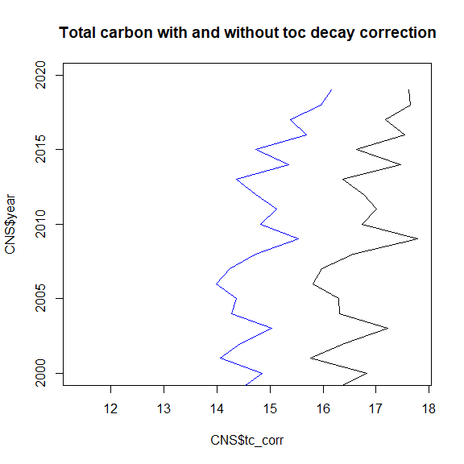<!-- -->

``` r
CNS$toc.n_corr <- CNS$toc_corr / CNS$tn_corr
# Mass accumulation rate caclulation
CNS$MAR <- CNS$calib.thickness.mm * CNS$dry_bulk_density_gcm3


# removing cracks
XRF_scaled <- cbind(XRF[, -c(4:16)], scale(XRF[, c(4:16)]))
crack_finder <- XRF_scaled$Ca.KA + XRF_scaled$Fe.KA + XRF_scaled$Si.KA # counts of abundant elements
XRF <- cbind(XRF, crack_finder)
XRF <- subset.data.frame(XRF, crack_finder > -2.9) # remove cracks (defined as areas with low abundances of common elements)

# assign ages based on depths
for (i in 1:nrow(Chrono)) {
  setDT(XRF)[comp_depth_mm <= Chrono$Comp.Depth[i] & comp_depth_mm >= Chrono$Comp.Depth[i + 1], year := Chrono$Year[i]]
}

XRF <- subset(XRF, year != 0) # subset only depths with assigned ages
XRF$cum_year_scale <- 0

# setting each year to be 1 unit long
for (i in 1:nrow(Chrono)) {
  setDT(XRF)[year == Chrono$Year[i], year_scale := seq(1, 0.001, length.out = nrow(subset(XRF, year == Chrono$Year[i])))]
}
XRF$cum_year_scale <- XRF$year_scale + XRF$year + 0.3

##### HSI data
HSI$year_scale <- 0
HSI$year_scale <- as.numeric(HSI$year_scale)
HSI$year <- 0
HSI$year <- as.numeric(HSI$year)
for (i in 1:nrow(Chrono)) {
  setDT(HSI)[HSI_depth <= Chrono$HSI_depth[i] & HSI_depth >= Chrono$HSI_depth[i + 1], year := Chrono$Year[i]]
}
### calibrating rabd indices according to calibration published in Zander et al., 2021 (Science of Total Environment)
HSI$TChl <- 1560.48 * HSI$`RABD655.685max` - 1578.9
HSI$Bphe <- HSI$RABD845 * 861.18 - 851.65
HSI[HSI < 0] <- 0

# setting each year to be 1 unit long (HSI version)
HSI <- subset(HSI, year != 0) # only including years with ages
HSI$cum_year_scale <- 0
for (i in 1:nrow(Chrono)) {
  setDT(HSI)[year == Chrono$Year[i], year_scale := seq(1, 0.001, length.out = nrow(subset(HSI, year == Chrono$Year[i])))]
}
HSI$cum_year_scale <- HSI$year_scale + HSI$year + 0.3

#### aligning and regularlizing XRF and HSI data
Source <- as.data.frame(HSI[, c(11, 3, 4, 9, 10)])
Destin <- as.data.frame(XRF[, 21])
Names <- colnames(Source)

# interpolate data for all columns
Data <- Destin
for (i in 2:ncol(Source)) {
  temp <- approx(Source[, 1], Source[, i], xout = Destin[, 1])
  Data[, i] <- temp$y
}
# Replace destination depth with interpolated depth (just to be sure it worked)
Data[, 1] <- temp$x
# Replace column names with actual names
colnames(Data) <- c("Depth_cm", Names[2:length(Names)])

## Full Dataset !
HiRes_full <- cbind(XRF[, c(21, 20, 18, 4:8, 10:12)], Data[, c(3, 4, 5)])
colnames(HiRes_full) <- c("Age", "Varve Year", "Comp Depth", "Ca", "Fe", "Mn", "Si", "P", "S", "K", "Ti", "Rmean", "TChl", "Bphe")


###### Aligning HSI to XRF using dynamical time warp alignment of Rmean and Ca
HiRes_full_scaled <- cbind(HiRes_full[, 1:3], scale(HiRes_full[, 4:14]))
test_dtw_P2 <- dtw(x = HiRes_full_scaled$Rmean, y = HiRes_full_scaled$Ca, window.type = "sakoechiba", 
                   window.size = 50, step.pattern = symmetricP2, keep = TRUE) 
# Sakoe Chiba band is simple symmetrical window (window width here is equal to the thinnest varve width, i.e. <= 1 year)
# Testing showed symmetric P2 is most reasonable step pattern, but this could vary
plot(test_dtw_P2, type = "threeway")
```

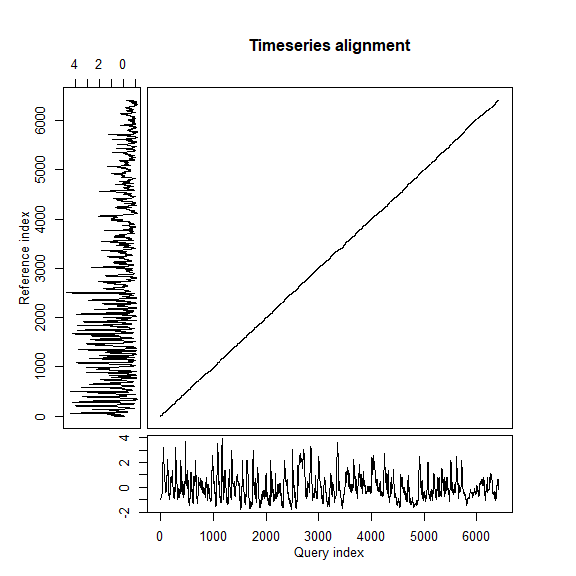<!-- -->

``` r
HSI_regular <- na.omit(Data[, 2:5])
warp <- warp(test_dtw_P2, index.reference = FALSE)
HSI_DTW <- HSI_regular[warp, ]

# example plot of DTW alignment
plot(HiRes_full_scaled$Age-0.3, HiRes_full_scaled$Ca, type = "l", xlim = c(2015, 2020), ylim= c(-2.5,4.5), main = "example plot of DTW alignment", xlab= "C (%)", ylab = "Z-score")
lines(HiRes_full_scaled$Age-0.3, HiRes_full_scaled$Rmean, col = "red")
lines(HiRes_full_scaled$Age-0.3, scale(HSI_DTW$Rmean), col = "blue")
abline(v=c(2015,2016,2017,2018,2019), lty=3)
legend(x = "bottomright",          # Position
       legend = c("Ca", "Rmean", "Rmean (after DTW)"),  # Legend texts
       lty = 1,           # Line types
       col = c("black", "red", "blue"),           # Line colors
       lwd = 2)                 # Line width
```

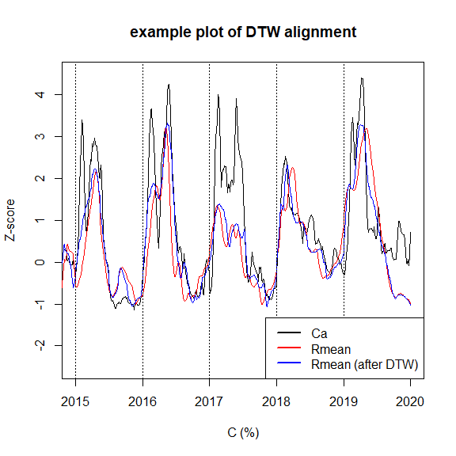<!-- -->

## Plotting full datasets

``` r
rm(test_dtw_P2)
# Putting together full, aligned dataset
HiRes_full[, 12:14] <- HSI_DTW[, c(2:4)]
colnames(HiRes_full)[c(2, 3)] <- c("varve_year", "comp_depth_mm")
HiRes_full_scaled <- cbind(HiRes_full[, 1:3], scale(HiRes_full[, 4:14]))
HiRes_full_sub1 <- HiRes_full[HiRes_full$`varve_year` >= 1966] # subset for study period 1966-2019
```

Plotting XRF and HSI data

``` r
color1 <- c("#c01d11", "2068c9", "#33799b", "#7c9b21", "#a54a0a", "#b3a22e", "#1798a1", "#a62b84", "#0f692d", "#500f8f") # color vector
XRF_piv <- tidyr::pivot_longer(HiRes_full, cols = c("Ca", "K", "Ti", "Si", "Fe", "S", "Mn", "P"), names_to = "proxy") # make sideways
xrf_data_plot_depth <- ggplot(XRF_piv, aes(value, comp_depth_mm, color = forcats::as_factor(proxy))) +
  geom_path() +
  scale_color_manual(values = color1) +
  scale_y_reverse(limits = c(345.06, 0.6)) +
  labs(y = "Depth (mm)", x = "cps", title = element_blank()) +
  facet_wrap(~proxy, ncol = 8, scales = "free") +
  theme_bw() +
  theme(
    strip.background = element_blank(),
    legend.box.background = element_blank(), legend.position = "none"
  )

HSI_piv <- tidyr::pivot_longer(HSI, cols = c("TChl", "Bphe"), names_to = "proxy") # make sideways
HSI_data_plot_depth <- ggplot(HSI_piv, aes(value, HSI_depth, color = forcats::as_factor(proxy))) +
  geom_path() +
  scale_color_manual(values = c("#0f692d", "#500f8f")) +
  scale_y_reverse(limits = c(320.04, 0.54)) +
  labs(y = element_blank(), x = "ug/g", title = element_blank()) +
  facet_wrap(~proxy, ncol = 8, scales = "free") +
  theme_bw() +
  theme(
    strip.background = element_blank(),
    legend.box.background = element_blank(), legend.position = "none"
  )

plot_grid(xrf_data_plot_depth, HSI_data_plot_depth, rel_widths = c(4 / 5, 1 / 5))
```

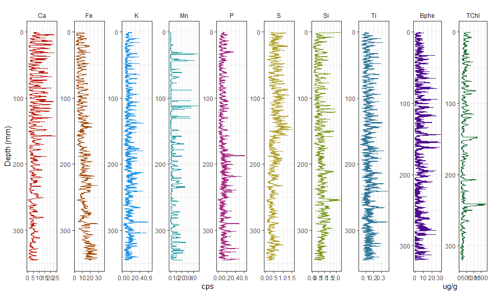<!-- -->

Plotting CNS, MAR, Cs-137

``` r
CNS <- CNS[CNS$year >= 1966 & CNS$year <= 2019, ]
par(mfrow = c(1, 6), mar = c(5.1, 2, 2, 1))
plot(CNS$tc_corr, CNS$year, ylim = c(1966, 2020), type = "o", pch = 16, xlim = c(0, 20), ylab = "Year (CE)", xlab = "C (% weight)")
lines(CNS$toc_corr, CNS$year, lty = 5, type = "o", pch = 16)
lines(CNS$tic_p, CNS$year, lty = 3, type = "o", pch = 16)
plot(CNS$toc.n_corr, CNS$year, ylim = c(1966, 2020), type = "o", pch = 16, xlim = c(0, 12), xlab = "TOC:N Ratio", yaxt = "n", lty = 3, ylab = "")
plot(CNS$tn_corr, CNS$year, ylim = c(1966, 2020), type = "o", pch = 16, xlim = c(0, 2), xlab = "N (% weight)", yaxt = "n", ylab = "")
plot(CNS$ts_p, CNS$year, ylim = c(1966, 2020), type = "o", pch = 16, xlim = c(0, 3), xlab = "S (% weight)", yaxt = "n", ylab = "")
plot(CNS$MAR, CNS$year, ylim = c(1966, 2020), type = "o", pch = 16, xlim = c(0, 2), xlab = "MAR (g cm-2 yr-1)", yaxt = "n", ylab = "")
plot(CNS[is.na(CNS$ZAB_12_1_Cs) == FALSE, ]$ZAB_12_1_Cs, CNS[is.na(CNS$ZAB_12_1_Cs) == FALSE, ]$year,
  ylim = c(1966, 2020), type = "o", pch = 16,
  xlab = "137Cs (Bq kg-1)", xlim = c(0, 350), yaxt = "n", ylab = ""
)
lines(CNS$Cs, CNS$year, type = "o", lty = 2, pch = 1)
```

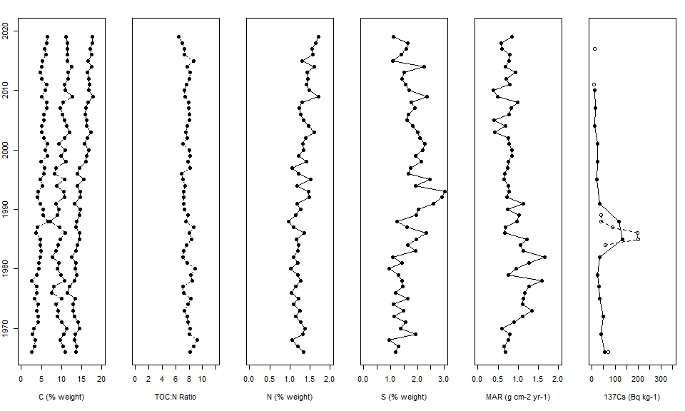<!-- -->

## Varve type classification based on multivariate clustering of sub-annual timeseries

Annual cyle

``` r
# First, aligning all data to a fractional varve year scale from 0 to 1
A <- rep("A", nrow(HiRes_full_sub1))
HiRes_full_sub1 <- as.data.frame(cbind(A, HiRes_full_sub1))

gap <- 0.02 # target resolution in fractional year units (each year will contain 50 data points)

int <- cut(HiRes_full_sub1$Age, seq(min(HiRes_full_sub1$Age), max(HiRes_full_sub1$Age + gap), by = gap), right = FALSE)
ag <- aggregate(HiRes_full_sub1[c(2, 4:15)], list(HiRes_full_sub1$A, int), mean)
ag$age_new <- seq(1966.3, 2020.28, length.out = nrow(ag))

ag$year_scale <- ag$age_new - floor(ag$age_new)
ag$year_scale <- round(ag$year_scale, 2)
for (i in 1:length(ag$year_scale)) {
  if (ag$year_scale[i] <= 0.3) {
    ag$year_scale[i] <- ag$year_scale[i] + 0.7
  } else {
    ag$year_scale[i] <- ag$year_scale[i] - 0.3
  }
}

ag <- as.data.frame(cbind(ag[16:17], ag[5:15]))
ag[, 3:13] <- scale(ag[, 3:13])
year_ag <- aggregate(ag[3:13], list(ag$year_scale), FUN = mean)

year_ag_piv1 <- tidyr::pivot_longer(year_ag, cols = c("Ca", "Ti", "Si", "Fe", "S", "Mn", "P", "TChl", "Bphe"), names_to = "proxy")
color2 <- c("#c01d11", "#33799b", "#7c9b21", "#a54a0a", "#b3a22e", "#1798a1", "#a62b84", "#0f692d", "#500f8f") # color vector
colnames(year_ag_piv1)[1] <- "year_scale"
#### annual cyle plot mean values
ann_cycle1 <- ggplot(year_ag_piv1, aes(year_scale, value, color = forcats::as_factor(proxy))) +
  geom_path(alpha = 0.6, lwd = 1.5) +
  scale_color_manual(values = color2) +
  labs(
    x = "",
    y = "Z-score",
    title = "Average Annual Cycle 1966-2019",
    color = "proxy"
  ) +
  theme_bw() +
  guides(colour = guide_legend(nrow = 1)) +
  theme(legend.position = "bottom")
ann_cycle1
```

<!-- -->

Varve type classification based on multivariate time series clustering
of within-varve time series

``` r
# preparing data for dissimilarity calculation: transform, detrend and scale data
sequence1 <- HiRes_full[, c(4:11, 13, 14)]
sequence1 <- sequence1 + 1
sequence1 <- log(sequence1)
sequence1 <- detrend(as.matrix(sequence1))
sequence1 <- as.data.frame(sequence1)
sequence1$`Bphe`[sequence1$`Bphe` <= sequence1$`Bphe`[6413]] <- sequence1$`Bphe`[6413] # resetting 0 baseline for Bphe after detrending
sequence1 <- cbind(HiRes_full$varve_year, XRF$year_scale[1:6413], scale(sequence1))
sequence1 <- as.data.frame(sequence1)
colnames(sequence1)[c(1, 2)] <- c("Varve_Year", "Year_scale")
sequence1 <- subset(sequence1, Varve_Year <= 2019 & Varve_Year >= 1966) # study period

psi1 <- workflowPsi(
  sequences = sequence1,
  grouping.column = "Varve_Year",
  time.column = "Year_scale",
  method = "euclidean",
  diagonal = TRUE,
  ignore.blocks = TRUE,
  format = "matrix"
)

hclust_1 <- hclust(as.dist(psi1), method = "ward.D2")
plot(hclust_1)
```

<!-- -->

Heatmap of dissimilarity scores

``` r
psi1_nozero <- psi1
psi1_nozero[psi1_nozero == 0] <- NA
heatmap(psi1_nozero, Rowv = as.dendrogram(hclust_1), Colv = as.dendrogram(hclust_1), symm = TRUE, col = viridis(256))
```

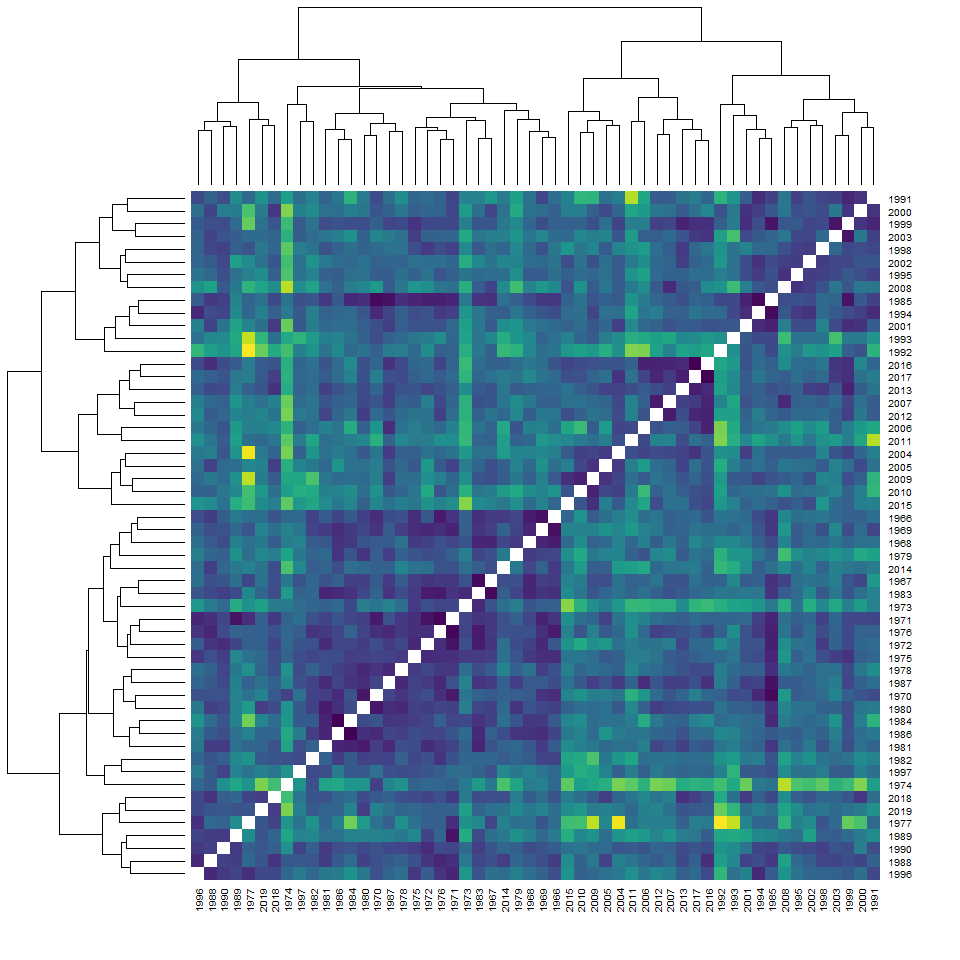<!-- -->

``` r
mycl <- cutree(hclust_1, h = 5.3)
mycl <- as.data.frame(mycl)
colnames(mycl) <- c("group")
mycl$year <- rownames(mycl)
```

Bar plot - importance of each element in driving year-to-year
dissimilarity

``` r
psi.importance <- workflowImportance(
  sequences = sequence1,
  grouping.column = "Varve_Year",
  time.column = "Year_scale",
  method = "euclidean",
  diagonal = TRUE,
  ignore.blocks = TRUE
)

psi.df <- psi.importance$psi
psi.drop.df <- psi.importance$psi.drop
barplot(colMeans(psi.drop.df[, 3:12]))
```

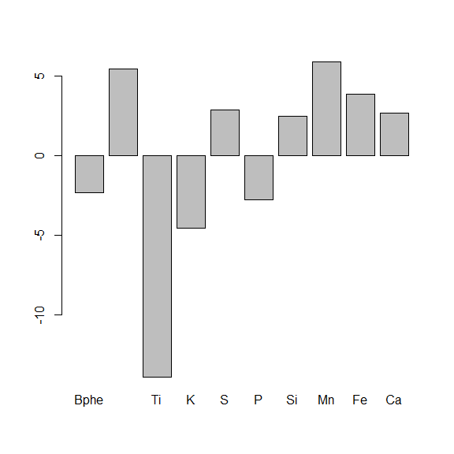<!-- -->

Varve Type plots

``` r
ag$varve_year <- ag$age_new - 0.3
ag$varve_year <- floor(ag$varve_year)
ag$clust_group <- 0
varve_years <- seq(2019, 1966, -1)
for (i in 1:length(ag$varve_year)) {
  for (j in 1:length(varve_years)) {
    if (ag$varve_year[i] == varve_years[j]) {
      ag$clust_group[i] <- mycl[j, 1]
    }
  }
}

# proxy clusters mean and 80% CIs
group1_ag <- aggregate(subset(ag, clust_group == 1), list(subset(ag, clust_group == 1)$year_scale), FUN = mean)
group1_90 <- aggregate(subset(ag, clust_group == 1), list(subset(ag, clust_group == 1)$year_scale), function(x) quantile(x, 0.90))
group1_10 <- aggregate(subset(ag, clust_group == 1), list(subset(ag, clust_group == 1)$year_scale), function(x) quantile(x, 0.10))
group2_ag <- aggregate(subset(ag, clust_group == 2), list(subset(ag, clust_group == 2)$year_scale), FUN = mean)
group2_90 <- aggregate(subset(ag, clust_group == 2), list(subset(ag, clust_group == 2)$year_scale), function(x) quantile(x, 0.9))
group2_10 <- aggregate(subset(ag, clust_group == 2), list(subset(ag, clust_group == 2)$year_scale), function(x) quantile(x, 0.1))
group3_ag <- aggregate(subset(ag, clust_group == 3), list(subset(ag, clust_group == 3)$year_scale), FUN = mean)
group3_90 <- aggregate(subset(ag, clust_group == 3), list(subset(ag, clust_group == 3)$year_scale), function(x) quantile(x, 0.9))
group3_10 <- aggregate(subset(ag, clust_group == 3), list(subset(ag, clust_group == 3)$year_scale), function(x) quantile(x, 0.1))
group4_ag <- aggregate(subset(ag, clust_group == 4), list(subset(ag, clust_group == 4)$year_scale), FUN = mean)
group4_90 <- aggregate(subset(ag, clust_group == 4), list(subset(ag, clust_group == 4)$year_scale), function(x) quantile(x, 0.9))
group4_10 <- aggregate(subset(ag, clust_group == 4), list(subset(ag, clust_group == 4)$year_scale), function(x) quantile(x, 0.1))

group1_ag_piv1 <- tidyr::pivot_longer(group1_ag, cols = c("Ca", "Ti", "Si", "Fe", "S", "Mn", "P", "TChl", "Bphe"), names_to = "proxy")
group1_ag_piv1 <- cbind(group1_ag_piv1[, c(3, 8, 9)], tidyr::pivot_longer(group1_90, cols = c("Ca", "Ti", "Si", "Fe", "S", "Mn", "P", "TChl", "Bphe"), names_to = "proxy", values_to = "p90th")[9], tidyr::pivot_longer(group1_10, cols = c("Ca", "Ti", "Si", "Fe", "S", "Mn", "P", "TChl", "Bphe"), names_to = "proxy", values_to = "p10th")[9])
group1_ag_piv1$group <- "Varve Type 1"

group2_ag_piv1 <- tidyr::pivot_longer(group2_ag, cols = c("Ca", "Ti", "Si", "Fe", "S", "Mn", "P", "TChl", "Bphe"), names_to = "proxy")
group2_ag_piv1 <- cbind(group2_ag_piv1[, c(3, 8, 9)], tidyr::pivot_longer(group2_90, cols = c("Ca", "Ti", "Si", "Fe", "S", "Mn", "P", "TChl", "Bphe"), names_to = "proxy", values_to = "p90th")[9], tidyr::pivot_longer(group2_10, cols = c("Ca", "Ti", "Si", "Fe", "S", "Mn", "P", "TChl", "Bphe"), names_to = "proxy", values_to = "p10th")[9])
group2_ag_piv1$group <- "Varve Type 2"

group3_ag_piv1 <- tidyr::pivot_longer(group3_ag, cols = c("Ca", "Ti", "Si", "Fe", "S", "Mn", "P", "TChl", "Bphe"), names_to = "proxy")
group3_ag_piv1 <- cbind(group3_ag_piv1[, c(3, 8, 9)], tidyr::pivot_longer(group3_90, cols = c("Ca", "Ti", "Si", "Fe", "S", "Mn", "P", "TChl", "Bphe"), names_to = "proxy", values_to = "p90th")[9], tidyr::pivot_longer(group3_10, cols = c("Ca", "Ti", "Si", "Fe", "S", "Mn", "P", "TChl", "Bphe"), names_to = "proxy", values_to = "p10th")[9])
group3_ag_piv1$group <- "Varve Type 3"

group4_ag_piv1 <- tidyr::pivot_longer(group4_ag, cols = c("Ca", "Ti", "Si", "Fe", "S", "Mn", "P", "TChl", "Bphe"), names_to = "proxy")
group4_ag_piv1 <- cbind(group4_ag_piv1[, c(3, 8, 9)], tidyr::pivot_longer(group4_90, cols = c("Ca", "Ti", "Si", "Fe", "S", "Mn", "P", "TChl", "Bphe"), names_to = "proxy", values_to = "p90th")[9], tidyr::pivot_longer(group4_10, cols = c("Ca", "Ti", "Si", "Fe", "S", "Mn", "P", "TChl", "Bphe"), names_to = "proxy", values_to = "p10th")[9])
group4_ag_piv1$group <- "Varve Type 4"

groups_all <- rbind(group1_ag_piv1, group2_ag_piv1, group3_ag_piv1, group4_ag_piv1)
groups_all$proxy_group <- "A"
groups_all[groups_all$proxy %in% c("Ca", "P", "TChl"), ]$proxy_group <- "A"
groups_all[groups_all$proxy %in% c("Fe", "S", "Mn"), ]$proxy_group <- "B"
groups_all[groups_all$proxy %in% c("Ti", "Si", "Bphe"), ]$proxy_group <- "C"

# plot
all_groups_plot2 <- ggplot(groups_all, aes(year_scale)) +
  geom_path(aes(x = year_scale, y = value, color = forcats::as_factor(proxy)), size = 1) +
  geom_ribbon(aes(ymin = p10th, ymax = p90th, fill = forcats::as_factor(proxy)), alpha = 0.3) +
  scale_color_manual(values = c(color2)) +
  scale_fill_manual(values = c(color2)) +
  labs(
    x = "",
    y = "Z-score",
    color = "proxy"
  ) +
  theme_bw() +
  guides(colour = guide_legend(nrow = 1)) +
  theme(legend.position = "bottom") +
  facet_grid(rows = vars(group), cols = vars(proxy_group))
all_groups_plot2
```

<!-- -->

## Comparing meteorological conditions in years defined by varve types

Boxplot of seasonal weather by varve type

``` r
### aggregate meteo data into annual seasonal values
Ket_meteo <- subset.data.frame(meteo, station == "K?TRZYN")
# substitute missing wind data with mean values
Ket_meteo$ws_mean_daily[(29309 - 19173):(29683 - 19173)] <- NA
Ket_meteo <- Ket_meteo %>%
  group_by(day_of_year) %>%
  mutate(ws_mean_daily = replace(ws_mean_daily, is.na(ws_mean_daily), mean(ws_mean_daily, na.rm = TRUE))) %>%
  ungroup()
Ket_meteo <- as.data.frame(Ket_meteo)
# define varve year as March to March
Ket_meteo$varve_year <- Ket_meteo$yy
Ket_meteo$varve_year[Ket_meteo$mm == 1 | Ket_meteo$mm == 2] <- Ket_meteo$yy[Ket_meteo$mm == 1 | Ket_meteo$mm == 2] - 1

meteo_ann_mean <- aggregate(Ket_meteo[, c(9, 11, 39)], list(Ket_meteo$varve_year), mean)
colnames(meteo_ann_mean) <- c("varve_year", "Temp_ANN", "Precip_ANN", "Wind_ANN")
meteo_ann_mean <- subset(meteo_ann_mean, varve_year >= 1966)

# creating empty columns
meteo_ann_mean$Temp_MAM <- 0
meteo_ann_mean$Temp_JJA <- 0
meteo_ann_mean$Temp_SON <- 0
meteo_ann_mean$Temp_DJF <- 0
meteo_ann_mean$Temp_MAM_lag1 <- 0
meteo_ann_mean$Temp_MAMJJA <- 0

meteo_ann_mean$p90_Precip_MAM <- 0
meteo_ann_mean$p90_Precip_JJA <- 0
meteo_ann_mean$p90_Precip_SON <- 0
meteo_ann_mean$p90_Precip_DJF <- 0
meteo_ann_mean$p90_Precip_MAM_lag1 <- 0

meteo_ann_mean$p90_Wind_MAM <- 0
meteo_ann_mean$p90_Wind_JJA <- 0
meteo_ann_mean$p90_Wind_SON <- 0
meteo_ann_mean$p90_Wind_DJF <- 0
meteo_ann_mean$p90_Wind_MAM_lag1 <- 0
meteo_ann_mean$MAR_DEC_Wind_Days <- 0

meteo_ann_mean$Temp_MAR <- 0
meteo_ann_mean$Temp_APR <- 0
meteo_ann_mean$Temp_MAY <- 0
meteo_ann_mean$Temp_JUN <- 0
meteo_ann_mean$Temp_JUL <- 0
meteo_ann_mean$Temp_AUG <- 0
meteo_ann_mean$Temp_SEP <- 0
meteo_ann_mean$Temp_OCT <- 0
meteo_ann_mean$Temp_NOV <- 0
meteo_ann_mean$Temp_DEC <- 0
meteo_ann_mean$Temp_JAN_LAG1 <- 0
meteo_ann_mean$Temp_FEB_LAG1 <- 0
meteo_ann_mean$Temp_MAR_LAG1 <- 0
meteo_ann_mean$Temp_APR_LAG1 <- 0
meteo_ann_mean$Temp_MAY_LAG1 <- 0

meteo_ann_mean$p90_Precip_MAR <- 0
meteo_ann_mean$p90_Precip_APR <- 0
meteo_ann_mean$p90_Precip_MAY <- 0
meteo_ann_mean$p90_Precip_JUN <- 0
meteo_ann_mean$p90_Precip_JUL <- 0
meteo_ann_mean$p90_Precip_AUG <- 0
meteo_ann_mean$p90_Precip_SEP <- 0
meteo_ann_mean$p90_Precip_OCT <- 0
meteo_ann_mean$p90_Precip_NOV <- 0
meteo_ann_mean$p90_Precip_DEC <- 0
meteo_ann_mean$p90_Precip_JAN_LAG1 <- 0
meteo_ann_mean$p90_Precip_FEB_LAG1 <- 0
meteo_ann_mean$p90_Precip_MAR_LAG1 <- 0
meteo_ann_mean$p90_Precip_APR_LAG1 <- 0
meteo_ann_mean$p90_Precip_MAY_LAG1 <- 0

meteo_ann_mean$p90_Wind_MAR <- 0
meteo_ann_mean$p90_Wind_APR <- 0
meteo_ann_mean$p90_Wind_MAY <- 0
meteo_ann_mean$p90_Wind_JUN <- 0
meteo_ann_mean$p90_Wind_JUL <- 0
meteo_ann_mean$p90_Wind_AUG <- 0
meteo_ann_mean$p90_Wind_SEP <- 0
meteo_ann_mean$p90_Wind_OCT <- 0
meteo_ann_mean$p90_Wind_NOV <- 0
meteo_ann_mean$p90_Wind_DEC <- 0
meteo_ann_mean$p90_Wind_JAN_LAG1 <- 0
meteo_ann_mean$p90_Wind_FEB_LAG1 <- 0
meteo_ann_mean$p90_Wind_MAR_LAG1 <- 0
meteo_ann_mean$p90_Wind_APR_LAG1 <- 0
meteo_ann_mean$p90_Wind_MAY_LAG1 <- 0

# filling in with annualized data
wt <- 7 # threshold for wind days (m/s)

for (i in 1:nrow(meteo_ann_mean)) {
  meteo_ann_mean$Temp_MAM[i] <- mean(subset.data.frame(Ket_meteo, yy == meteo_ann_mean$varve_year[i] & mm <= 5 & mm >= 3)[, 9])
  meteo_ann_mean$Temp_JJA[i] <- mean(subset.data.frame(Ket_meteo, yy == meteo_ann_mean$varve_year[i] & mm <= 8 & mm >= 6)[, 9])
  meteo_ann_mean$Temp_SON[i] <- mean(subset.data.frame(Ket_meteo, yy == meteo_ann_mean$varve_year[i] & mm <= 11 & mm >= 9)[, 9])
  meteo_ann_mean$Temp_MAMJJA[i] <- mean(subset.data.frame(Ket_meteo, yy == meteo_ann_mean$varve_year[i] & mm <= 8 & mm >= 3)[, 9])
  D <- as.data.frame(subset.data.frame(Ket_meteo, yy == meteo_ann_mean$varve_year[i] & mm == 12)[, 9])
  JF <- as.data.frame(subset.data.frame(Ket_meteo, yy == meteo_ann_mean$varve_year[i + 1] & mm <= 2)[, 9])
  colnames(D) <- "a"
  colnames(JF) <- "a"
  DJF <- rbind(D, JF)
  meteo_ann_mean$Temp_DJF[i] <- mean(DJF$a)

  meteo_ann_mean$Temp_MAR[i] <- mean(subset.data.frame(Ket_meteo, yy == meteo_ann_mean$varve_year[i] & mm == 3)[, 9])
  meteo_ann_mean$Temp_APR[i] <- mean(subset.data.frame(Ket_meteo, yy == meteo_ann_mean$varve_year[i] & mm == 4)[, 9])
  meteo_ann_mean$Temp_MAY[i] <- mean(subset.data.frame(Ket_meteo, yy == meteo_ann_mean$varve_year[i] & mm == 5)[, 9])
  meteo_ann_mean$Temp_JUN[i] <- mean(subset.data.frame(Ket_meteo, yy == meteo_ann_mean$varve_year[i] & mm == 6)[, 9])
  meteo_ann_mean$Temp_JUL[i] <- mean(subset.data.frame(Ket_meteo, yy == meteo_ann_mean$varve_year[i] & mm == 7)[, 9])
  meteo_ann_mean$Temp_AUG[i] <- mean(subset.data.frame(Ket_meteo, yy == meteo_ann_mean$varve_year[i] & mm == 8)[, 9])
  meteo_ann_mean$Temp_SEP[i] <- mean(subset.data.frame(Ket_meteo, yy == meteo_ann_mean$varve_year[i] & mm == 9)[, 9])
  meteo_ann_mean$Temp_OCT[i] <- mean(subset.data.frame(Ket_meteo, yy == meteo_ann_mean$varve_year[i] & mm == 10)[, 9])
  meteo_ann_mean$Temp_NOV[i] <- mean(subset.data.frame(Ket_meteo, yy == meteo_ann_mean$varve_year[i] & mm == 11)[, 9])
  meteo_ann_mean$Temp_DEC[i] <- mean(subset.data.frame(Ket_meteo, yy == meteo_ann_mean$varve_year[i] & mm == 12)[, 9])
  meteo_ann_mean$Temp_JAN_LAG1[i] <- mean(subset.data.frame(Ket_meteo, yy == meteo_ann_mean$varve_year[i] + 1 & mm == 1)[, 9])
  meteo_ann_mean$Temp_FEB_LAG1[i] <- mean(subset.data.frame(Ket_meteo, yy == meteo_ann_mean$varve_year[i] + 1 & mm == 2)[, 9])
  meteo_ann_mean$Temp_MAR_LAG1[i] <- mean(subset.data.frame(Ket_meteo, yy == meteo_ann_mean$varve_year[i] + 1 & mm == 3)[, 9])
  meteo_ann_mean$Temp_APR_LAG1[i] <- mean(subset.data.frame(Ket_meteo, yy == meteo_ann_mean$varve_year[i] + 1 & mm == 4)[, 9])
  meteo_ann_mean$Temp_MAY_LAG1[i] <- mean(subset.data.frame(Ket_meteo, yy == meteo_ann_mean$varve_year[i] + 1 & mm == 5)[, 9])


  meteo_ann_mean$p90_Precip_MAM[i] <- stats::quantile((subset(Ket_meteo, yy == meteo_ann_mean$varve_year[i] & mm <= 5 & mm >= 3)[, 11]), probs = 0.9)
  meteo_ann_mean$p90_Precip_JJA[i] <- quantile((subset.data.frame(Ket_meteo, yy == meteo_ann_mean$varve_year[i] & mm <= 8 & mm >= 6)[, 11]), 0.9)
  meteo_ann_mean$p90_Precip_SON[i] <- quantile((subset.data.frame(Ket_meteo, yy == meteo_ann_mean$varve_year[i] & mm <= 11 & mm >= 9)[, 11]), 0.9)
  D <- as.data.frame(subset.data.frame(Ket_meteo, yy == meteo_ann_mean$varve_year[i] & mm == 12)[, 11])
  JF <- as.data.frame(subset.data.frame(Ket_meteo, yy == meteo_ann_mean$varve_year[i + 1] & mm <= 2)[, 11])
  colnames(D) <- "a"
  colnames(JF) <- "a"
  DJF <- rbind(D, JF)
  meteo_ann_mean$p90_Precip_DJF[i] <- quantile(DJF$a, 0.9)

  meteo_ann_mean$p90_Precip_MAR[i] <- stats::quantile(subset.data.frame(Ket_meteo, yy == meteo_ann_mean$varve_year[i] & mm == 3)[, 11], probs = 0.9)
  meteo_ann_mean$p90_Precip_APR[i] <- stats::quantile(subset.data.frame(Ket_meteo, yy == meteo_ann_mean$varve_year[i] & mm == 4)[, 11], probs = 0.9)
  meteo_ann_mean$p90_Precip_MAY[i] <- stats::quantile(subset.data.frame(Ket_meteo, yy == meteo_ann_mean$varve_year[i] & mm == 5)[, 11], probs = 0.9)
  meteo_ann_mean$p90_Precip_JUN[i] <- stats::quantile(subset.data.frame(Ket_meteo, yy == meteo_ann_mean$varve_year[i] & mm == 6)[, 11], probs = 0.9)
  meteo_ann_mean$p90_Precip_JUL[i] <- stats::quantile(subset.data.frame(Ket_meteo, yy == meteo_ann_mean$varve_year[i] & mm == 7)[, 11], probs = 0.9)
  meteo_ann_mean$p90_Precip_AUG[i] <- stats::quantile(subset.data.frame(Ket_meteo, yy == meteo_ann_mean$varve_year[i] & mm == 8)[, 11], probs = 0.9)
  meteo_ann_mean$p90_Precip_SEP[i] <- stats::quantile(subset.data.frame(Ket_meteo, yy == meteo_ann_mean$varve_year[i] & mm == 9)[, 11], probs = 0.9)
  meteo_ann_mean$p90_Precip_OCT[i] <- stats::quantile(subset.data.frame(Ket_meteo, yy == meteo_ann_mean$varve_year[i] & mm == 10)[, 11], probs = 0.9)
  meteo_ann_mean$p90_Precip_NOV[i] <- stats::quantile(subset.data.frame(Ket_meteo, yy == meteo_ann_mean$varve_year[i] & mm == 11)[, 11], probs = 0.9)
  meteo_ann_mean$p90_Precip_DEC[i] <- stats::quantile(subset.data.frame(Ket_meteo, yy == meteo_ann_mean$varve_year[i] & mm == 12)[, 11], probs = 0.9)
  meteo_ann_mean$p90_Precip_JAN_LAG1[i] <- stats::quantile(subset.data.frame(Ket_meteo, yy == meteo_ann_mean$varve_year[i] + 1 & mm == 1)[, 11], probs = 0.9)
  meteo_ann_mean$p90_Precip_FEB_LAG1[i] <- stats::quantile(subset.data.frame(Ket_meteo, yy == meteo_ann_mean$varve_year[i] + 1 & mm == 2)[, 11], probs = 0.9)
  meteo_ann_mean$p90_Precip_MAR_LAG1[i] <- stats::quantile(subset.data.frame(Ket_meteo, yy == meteo_ann_mean$varve_year[i] + 1 & mm == 3)[, 11], probs = 0.9)
  meteo_ann_mean$p90_Precip_APR_LAG1[i] <- stats::quantile(subset.data.frame(Ket_meteo, yy == meteo_ann_mean$varve_year[i] + 1 & mm == 4)[, 11], probs = 0.9)
  meteo_ann_mean$p90_Precip_MAY_LAG1[i] <- stats::quantile(subset.data.frame(Ket_meteo, yy == meteo_ann_mean$varve_year[i] + 1 & mm == 5)[, 11], probs = 0.9)


  meteo_ann_mean$p90_Wind_MAM[i] <- quantile((subset.data.frame(Ket_meteo, yy == meteo_ann_mean$varve_year[i] & mm <= 5 & mm >= 3)$ws_mean_daily), 0.9)
  meteo_ann_mean$p90_Wind_JJA[i] <- quantile((subset.data.frame(Ket_meteo, yy == meteo_ann_mean$varve_year[i] & mm <= 8 & mm >= 6)$ws_mean_daily), 0.9)
  meteo_ann_mean$p90_Wind_SON[i] <- quantile((subset.data.frame(Ket_meteo, yy == meteo_ann_mean$varve_year[i] & mm <= 11 & mm >= 9)$ws_mean_daily), 0.9)
  D <- as.data.frame(subset.data.frame(Ket_meteo, yy == meteo_ann_mean$varve_year[i] & mm == 12)$ws_mean_daily)
  JF <- as.data.frame(subset.data.frame(Ket_meteo, yy == meteo_ann_mean$varve_year[i + 1] & mm <= 2)$ws_mean_daily)
  colnames(D) <- "a"
  colnames(JF) <- "a"
  DJF <- rbind(D, JF)
  meteo_ann_mean$p90_Wind_DJF[i] <- quantile(DJF$a, 0.9)
  meteo_ann_mean$MAR_DEC_Wind_Days[i] <- nrow(subset.data.frame(Ket_meteo, yy == meteo_ann_mean$varve_year[i] & ws_mean_daily >= wt & mm >= 3))

  meteo_ann_mean$p90_Wind_MAR[i] <- stats::quantile(subset.data.frame(Ket_meteo, yy == meteo_ann_mean$varve_year[i] & mm == 3)[, 39], probs = 0.9)
  meteo_ann_mean$p90_Wind_APR[i] <- stats::quantile(subset.data.frame(Ket_meteo, yy == meteo_ann_mean$varve_year[i] & mm == 4)[, 39], probs = 0.9)
  meteo_ann_mean$p90_Wind_MAY[i] <- stats::quantile(subset.data.frame(Ket_meteo, yy == meteo_ann_mean$varve_year[i] & mm == 5)[, 39], probs = 0.9)
  meteo_ann_mean$p90_Wind_JUN[i] <- stats::quantile(subset.data.frame(Ket_meteo, yy == meteo_ann_mean$varve_year[i] & mm == 6)[, 39], probs = 0.9)
  meteo_ann_mean$p90_Wind_JUL[i] <- stats::quantile(subset.data.frame(Ket_meteo, yy == meteo_ann_mean$varve_year[i] & mm == 7)[, 39], probs = 0.9)
  meteo_ann_mean$p90_Wind_AUG[i] <- stats::quantile(subset.data.frame(Ket_meteo, yy == meteo_ann_mean$varve_year[i] & mm == 8)[, 39], probs = 0.9)
  meteo_ann_mean$p90_Wind_SEP[i] <- stats::quantile(subset.data.frame(Ket_meteo, yy == meteo_ann_mean$varve_year[i] & mm == 9)[, 39], probs = 0.9)
  meteo_ann_mean$p90_Wind_OCT[i] <- stats::quantile(subset.data.frame(Ket_meteo, yy == meteo_ann_mean$varve_year[i] & mm == 10)[, 39], probs = 0.9)
  meteo_ann_mean$p90_Wind_NOV[i] <- stats::quantile(subset.data.frame(Ket_meteo, yy == meteo_ann_mean$varve_year[i] & mm == 11)[, 39], probs = 0.9)
  meteo_ann_mean$p90_Wind_DEC[i] <- stats::quantile(subset.data.frame(Ket_meteo, yy == meteo_ann_mean$varve_year[i] & mm == 12)[, 39], probs = 0.9)
  meteo_ann_mean$p90_Wind_JAN_LAG1[i] <- stats::quantile(subset.data.frame(Ket_meteo, yy == meteo_ann_mean$varve_year[i] + 1 & mm == 1)[, 39], probs = 0.9)
  meteo_ann_mean$p90_Wind_FEB_LAG1[i] <- stats::quantile(subset.data.frame(Ket_meteo, yy == meteo_ann_mean$varve_year[i] + 1 & mm == 2)[, 39], probs = 0.9)
  meteo_ann_mean$p90_Wind_MAR_LAG1[i] <- stats::quantile(subset.data.frame(Ket_meteo, yy == meteo_ann_mean$varve_year[i] + 1 & mm == 3)[, 39], probs = 0.9)
  meteo_ann_mean$p90_Wind_APR_LAG1[i] <- stats::quantile(subset.data.frame(Ket_meteo, yy == meteo_ann_mean$varve_year[i] + 1 & mm == 4)[, 39], probs = 0.9)
  meteo_ann_mean$p90_Wind_MAY_LAG1[i] <- stats::quantile(subset.data.frame(Ket_meteo, yy == meteo_ann_mean$varve_year[i] + 1 & mm == 5)[, 39], probs = 0.9)
}

# calculating MAM_lag1 (spring of year after varve year, this may be included in some varves)
meteo_ann_mean$Temp_MAM_lag1 <- c(meteo_ann_mean$Temp_MAM[2:54], NA)
meteo_ann_mean$p90_Wind_MAM_lag1 <- c(meteo_ann_mean$p90_Wind_MAM[2:54], NA)
meteo_ann_mean$p90_Precip_MAM_lag1 <- c(meteo_ann_mean$p90_Precip_MAM[2:54], NA)

# substituting mean values in years with missing wind data
meteo_ann_mean[28, c(18:21, 58:66)] <- colMeans(na.omit(meteo_ann_mean[c(-28, -29), ]))[c(18:21, 58:66)]
meteo_ann_mean[29, c(16:18, 21, 52:60)] <- colMeans(na.omit(meteo_ann_mean[c(-28, -29), ]))[c(16:18, 21, 52:60)]

# Boxplot of seasonal weather by varve type
meteo_clust <- as.data.frame(cbind(mycl[54:1, 1], meteo_ann_mean[, 1], scale(meteo_ann_mean[c(5:9, 11:20)])))
colnames(meteo_clust)[c(1, 2)] <- c("Group", "Year")
meteo_clust_piv <- tidyr::pivot_longer(meteo_clust, cols = colnames(meteo_clust)[c(3:17)], names_to = "variable")
meteo_clust_piv$variable <- rep(c("MAM", "JJA", "SON", "DJF", "MAM_lag1"), 54 * 3)
meteo_clust_piv$variable <- factor(meteo_clust_piv$variable, levels = c("MAM", "JJA", "SON", "DJF", "MAM_lag1"))
meteo_clust_piv$met_var <- rep(c("temp", "temp", "temp", "temp", "temp", "p90_precip", "p90_precip", "p90_precip", "p90_precip", "p90_precip", "p90_wind", "p90_wind", "p90_wind", "p90_wind", "p90_wind"), 54)
cbPalette <- c("#D55E00", "#56B4E9", "#009E73", "#F0E442")
groups_plot2 <- ggplot() +
  geom_boxplot(data = meteo_clust_piv, aes(x = variable, y = value, fill = factor(Group)), lwd = 0.3, outlier.size = 0.2) +
  xlab("Season") +
  scale_fill_manual(values = cbPalette) +
  ylab("Z-score") +
  theme(legend.title = element_blank(), panel.grid = element_blank()) +
  facet_grid(rows = vars(met_var))
groups_plot2 + geom_hline(yintercept = 0, linetype = "dashed")
```

<!-- -->

Assessing normality - some variables show positive skew, however ANOVA
is not strongly sensitive to normality assumption, so we proceed

``` r
## assessing normality
ggplot(data = meteo_clust_piv, aes(x = value)) +
  stat_density() +
  facet_grid(rows = vars(met_var), cols = vars(variable), scales = "free_y")
```

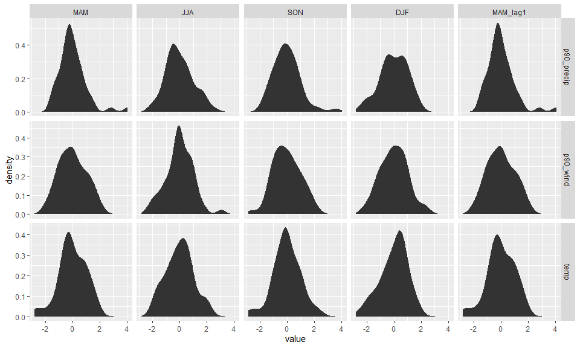<!-- -->

``` r
y <- as.data.frame(meteo_clust[, c(3:17)])

"Shapiro-Wilks test"
```

    ## [1] "Shapiro-Wilks test"

``` r
shapiro_test_df <- function(df, bonf = TRUE, alpha = 0.05) {
  l <- lapply(df, shapiro.test)
  s <- do.call("c", lapply(l, "[[", 1))
  p <- do.call("c", lapply(l, "[[", 2))
  if (bonf == TRUE) {
    sig <- ifelse(p > alpha / length(l), "H0", "Ha")
  } else {
    sig <- ifelse(p > alpha, "H0", "Ha")
  }
  return(list(
    statistic = s,
    p.value = p,
    significance = sig,
    method = ifelse(bonf == TRUE, "Shapiro-Wilks test with Bonferroni Correction",
      "Shapiro-Wilks test without Bonferroni Correction"
    )
  ))
}

shapiro_test_df(y, bonf = TRUE)
```

    ## $statistic
    ##            Temp_MAM.W            Temp_JJA.W            Temp_SON.W 
    ##             0.9702331             0.9735592             0.9792417 
    ##            Temp_DJF.W       Temp_MAM_lag1.W      p90_Precip_MAM.W 
    ##             0.9707698             0.9708621             0.8881146 
    ##      p90_Precip_JJA.W      p90_Precip_SON.W      p90_Precip_DJF.W 
    ##             0.9793625             0.9506285             0.9773174 
    ## p90_Precip_MAM_lag1.W        p90_Wind_MAM.W        p90_Wind_JJA.W 
    ##             0.8866153             0.9768590             0.9764569 
    ##        p90_Wind_SON.W        p90_Wind_DJF.W   p90_Wind_MAM_lag1.W 
    ##             0.9810630             0.9862046             0.9773622 
    ## 
    ## $p.value
    ##            Temp_MAM            Temp_JJA            Temp_SON            Temp_DJF 
    ##        0.1973847411        0.2751992104        0.4685928590        0.2083880995 
    ##       Temp_MAM_lag1      p90_Precip_MAM      p90_Precip_JJA      p90_Precip_SON 
    ##        0.2198589151        0.0001132049        0.4735658925        0.0264979994 
    ##      p90_Precip_DJF p90_Precip_MAM_lag1        p90_Wind_MAM        p90_Wind_JJA 
    ##        0.3940685521        0.0001164720        0.3776767268        0.3637323773 
    ##        p90_Wind_SON        p90_Wind_DJF   p90_Wind_MAM_lag1 
    ##        0.5469326229        0.7871439074        0.4080749462 
    ## 
    ## $significance
    ##            Temp_MAM            Temp_JJA            Temp_SON            Temp_DJF 
    ##                "H0"                "H0"                "H0"                "H0" 
    ##       Temp_MAM_lag1      p90_Precip_MAM      p90_Precip_JJA      p90_Precip_SON 
    ##                "H0"                "Ha"                "H0"                "H0" 
    ##      p90_Precip_DJF p90_Precip_MAM_lag1        p90_Wind_MAM        p90_Wind_JJA 
    ##                "H0"                "Ha"                "H0"                "H0" 
    ##        p90_Wind_SON        p90_Wind_DJF   p90_Wind_MAM_lag1 
    ##                "H0"                "H0"                "H0" 
    ## 
    ## $method
    ## [1] "Shapiro-Wilks test with Bonferroni Correction"

Analysis of variance. Null Hypothesis: years associated with the four
varve types experienced the same meteorological conditions Note:
significance code symbols are different here than in the manuscript

``` r
# Analysis of variance
y <- as.matrix(meteo_clust[, c(3:17)])
manova1 <- manova(y ~ as.factor(meteo_clust$Group))
"multivariate analysis of variance"
```

    ## [1] "multivariate analysis of variance"

``` r
summary(manova1)
```

    ##                              Df Pillai approx F num Df den Df  Pr(>F)   
    ## as.factor(meteo_clust$Group)  3 1.3648   2.0587     45    111 0.00119 **
    ## Residuals                    49                                         
    ## ---
    ## Signif. codes:  0 '***' 0.001 '**' 0.01 '*' 0.05 '.' 0.1 ' ' 1

``` r
"analysis of variance for each meteo variable"
```

    ## [1] "analysis of variance for each meteo variable"

``` r
summary.aov(manova1)
```

    ##  Response Temp_MAM :
    ##                              Df Sum Sq Mean Sq F value  Pr(>F)  
    ## as.factor(meteo_clust$Group)  3  9.634  3.2113  3.7265 0.01717 *
    ## Residuals                    49 42.226  0.8618                  
    ## ---
    ## Signif. codes:  0 '***' 0.001 '**' 0.01 '*' 0.05 '.' 0.1 ' ' 1
    ## 
    ##  Response Temp_JJA :
    ##                              Df Sum Sq Mean Sq F value  Pr(>F)   
    ## as.factor(meteo_clust$Group)  3 10.328  3.4427  4.2776 0.00926 **
    ## Residuals                    49 39.437  0.8048                   
    ## ---
    ## Signif. codes:  0 '***' 0.001 '**' 0.01 '*' 0.05 '.' 0.1 ' ' 1
    ## 
    ##  Response Temp_SON :
    ##                              Df Sum Sq Mean Sq F value  Pr(>F)  
    ## as.factor(meteo_clust$Group)  3  9.516  3.1720  3.8796 0.01445 *
    ## Residuals                    49 40.063  0.8176                  
    ## ---
    ## Signif. codes:  0 '***' 0.001 '**' 0.01 '*' 0.05 '.' 0.1 ' ' 1
    ## 
    ##  Response Temp_DJF :
    ##                              Df Sum Sq Mean Sq F value Pr(>F)
    ## as.factor(meteo_clust$Group)  3  4.044 1.34791  1.4606 0.2368
    ## Residuals                    49 45.221 0.92287               
    ## 
    ##  Response Temp_MAM_lag1 :
    ##                              Df Sum Sq Mean Sq F value   Pr(>F)   
    ## as.factor(meteo_clust$Group)  3 11.214  3.7378  4.4906 0.007316 **
    ## Residuals                    49 40.786  0.8324                    
    ## ---
    ## Signif. codes:  0 '***' 0.001 '**' 0.01 '*' 0.05 '.' 0.1 ' ' 1
    ## 
    ##  Response p90_Precip_MAM :
    ##                              Df Sum Sq Mean Sq F value Pr(>F)
    ## as.factor(meteo_clust$Group)  3  4.379 1.45983  1.4974 0.2269
    ## Residuals                    49 47.772 0.97494               
    ## 
    ##  Response p90_Precip_JJA :
    ##                              Df Sum Sq Mean Sq F value  Pr(>F)  
    ## as.factor(meteo_clust$Group)  3  6.608 2.20273  2.3277 0.08605 .
    ## Residuals                    49 46.370 0.94633                  
    ## ---
    ## Signif. codes:  0 '***' 0.001 '**' 0.01 '*' 0.05 '.' 0.1 ' ' 1
    ## 
    ##  Response p90_Precip_SON :
    ##                              Df Sum Sq Mean Sq F value Pr(>F)
    ## as.factor(meteo_clust$Group)  3  2.901 0.96688  0.9485 0.4245
    ## Residuals                    49 49.952 1.01943               
    ## 
    ##  Response p90_Precip_DJF :
    ##                              Df Sum Sq Mean Sq F value Pr(>F)
    ## as.factor(meteo_clust$Group)  3  4.451 1.48374  1.5861 0.2047
    ## Residuals                    49 45.839 0.93549               
    ## 
    ##  Response p90_Precip_MAM_lag1 :
    ##                              Df Sum Sq Mean Sq F value Pr(>F)
    ## as.factor(meteo_clust$Group)  3  3.456  1.1519  1.1627 0.3335
    ## Residuals                    49 48.544  0.9907               
    ## 
    ##  Response p90_Wind_MAM :
    ##                              Df Sum Sq Mean Sq F value   Pr(>F)   
    ## as.factor(meteo_clust$Group)  3 14.809  4.9363  6.3359 0.001022 **
    ## Residuals                    49 38.176  0.7791                    
    ## ---
    ## Signif. codes:  0 '***' 0.001 '**' 0.01 '*' 0.05 '.' 0.1 ' ' 1
    ## 
    ##  Response p90_Wind_JJA :
    ##                              Df Sum Sq Mean Sq F value Pr(>F)
    ## as.factor(meteo_clust$Group)  3  5.054 1.68458  1.7229 0.1745
    ## Residuals                    49 47.911 0.97777               
    ## 
    ##  Response p90_Wind_SON :
    ##                              Df Sum Sq Mean Sq F value  Pr(>F)  
    ## as.factor(meteo_clust$Group)  3 10.760  3.5867  4.1827 0.01029 *
    ## Residuals                    49 42.017  0.8575                  
    ## ---
    ## Signif. codes:  0 '***' 0.001 '**' 0.01 '*' 0.05 '.' 0.1 ' ' 1
    ## 
    ##  Response p90_Wind_DJF :
    ##                              Df Sum Sq Mean Sq F value Pr(>F)
    ## as.factor(meteo_clust$Group)  3  1.919 0.63973  0.6153 0.6084
    ## Residuals                    49 50.943 1.03966               
    ## 
    ##  Response p90_Wind_MAM_lag1 :
    ##                              Df Sum Sq Mean Sq F value    Pr(>F)    
    ## as.factor(meteo_clust$Group)  3 19.538  6.5127  9.8306 3.477e-05 ***
    ## Residuals                    49 32.462  0.6625                      
    ## ---
    ## Signif. codes:  0 '***' 0.001 '**' 0.01 '*' 0.05 '.' 0.1 ' ' 1
    ## 
    ## 1 observation deleted due to missingness

## Correlations between meteorological data and sedimentary data

Assessing normality - some variables are non-normal, but we proceed with
correlation analysis. Emphasis is on understanding relationships, not
significance tests. Variables with highest correlations are normally
distributed.

``` r
# calculated annual means for geochemical data
proxy_ann_mean <- aggregate(HiRes_full[, c(4:11, 13, 14)], list(HiRes_full$varve_year), mean)
colnames(proxy_ann_mean)[1] <- "varve_year"
proxy_ann_mean <- proxy_ann_mean[proxy_ann_mean$varve_year >= 1966, ]
proxy_ann_all <- cbind(proxy_ann_mean[2:11], CNS[54:1, c(11, 37, 39, 38, 41)])
colnames(proxy_ann_all)[11:14] <- c("TIC", "TOC", "TC", "TN")

proxy_ann_all_piv <- tidyr::pivot_longer(proxy_ann_all, cols = colnames(proxy_ann_all), names_to = "proxy")
ggplot(data = proxy_ann_all_piv, aes(x = value)) +
  stat_density() +
  facet_wrap(facets = "proxy", nrow = 3, scales = "free")
```

<!-- -->

``` r
"Shapiro-Wilks test"
```

    ## [1] "Shapiro-Wilks test"

``` r
shapiro_test_df(proxy_ann_all, bonf = TRUE)
```

    ## $statistic
    ##      Ca.W      Fe.W      Mn.W      Si.W       P.W       S.W       K.W      Ti.W 
    ## 0.9696440 0.9131046 0.9241429 0.9814126 0.9476018 0.9637299 0.9572583 0.9853412 
    ##    TChl.W    Bphe.W     TIC.W     TOC.W      TC.W      TN.W     MAR.W 
    ## 0.9112746 0.9838330 0.9713009 0.9797486 0.9418974 0.9751930 0.9360141 
    ## 
    ## $p.value
    ##           Ca           Fe           Mn           Si            P            S 
    ## 0.1859328483 0.0008274316 0.0021517032 0.5627068717 0.0195840976 0.1012762802 
    ##            K           Ti         TChl         Bphe          TIC          TOC 
    ## 0.0519709111 0.7474558174 0.0007096279 0.6760597969 0.2198375108 0.4896885978 
    ##           TC           TN          MAR 
    ## 0.0111917053 0.3225689073 0.0063794821 
    ## 
    ## $significance
    ##   Ca   Fe   Mn   Si    P    S    K   Ti TChl Bphe  TIC  TOC   TC   TN  MAR 
    ## "H0" "Ha" "Ha" "H0" "H0" "H0" "H0" "H0" "Ha" "H0" "H0" "H0" "H0" "H0" "H0" 
    ## 
    ## $method
    ## [1] "Shapiro-Wilks test with Bonferroni Correction"

Seasonal correlations. Selected correlations from this analysis are
displayed in Table 1 of associated manuscript.

``` r
meteo_sub1 <- meteo_ann_mean[, c(5:21)] # seasonal meteo data
meteo_sub1[54, c(5, 11, 16)] <- colMeans(meteo_sub1[-54, ])[c(5, 11, 16)] # replacing missing data with means

# Seasonal correlations
cor_matrix_seasonal <- corbetw2mat(meteo_sub1, proxy_ann_all, what = "all")

AR_proxies <- acf(proxy_ann_all, lag = 1, plot = FALSE)
AR_proxies <- AR_proxies$acf

AR_meteo <- acf(meteo_sub1, lag = 1, plot = FALSE)
AR_meteo <- AR_meteo$acf

adj_n <- matrix(, nrow = ncol(meteo_sub1), ncol = ncol(proxy_ann_all))
# calculate adjusted n using method of Bretherton et al. (1999)

for (i in 1:ncol(meteo_sub1)) {
  for (j in 1:ncol(proxy_ann_all)) {
    adj_n[i, j] <- nrow(proxy_ann_all) * (1 - AR_meteo[2, i, i] * AR_proxies[2, j, j]) / (1 + AR_meteo[2, i, i] * AR_proxies[2, j, j])
  }
}
adj_n[adj_n > 54] <- 54
colnames(adj_n) <- colnames(proxy_ann_all)
rownames(adj_n) <- colnames(meteo_sub1)

pval <- corr.p(cor_matrix_seasonal, n = adj_n, adjust = "fdr")$p
cor_matrix_seasonal <- t(cor_matrix_seasonal)
pval <- t(pval)
corrplot(cor_matrix_seasonal, method = "color", p.mat = pval, sig.level = c(0.01, 0.05, 0.1), pch = c("."), insig = "label_sig")
```

<!-- -->

Correlations with monthly meteo data and full correlation plot

``` r
meteo_sub2 <- meteo_ann_mean[, 22:66] # monthly meteo data
meteo_sub2[54, c(13:15, 28:30, 43:45)] <- colMeans(meteo_sub2[-54, ])[c(13:15, 28:30, 43:45)] # replacing missing data with means

cor_matrix_months <- corbetw2mat(proxy_ann_all, meteo_sub2, what = "all")
colnames(cor_matrix_months) <- c("Temp MAR", "Temp APR", "Temp MAY", "Temp JUN", "Temp JUL", "Temp AUG", "Temp SEP", "Temp OCT", "Temp NOV", "Temp DEC", "Temp JAN", "Temp FEB", "Temp-MAR", "Temp-APR", "Temp-MAY", "Precip MAR", "Precip APR", "Precip MAY", "Precip JUN", "Precip JUL", "Precip AUG", "Precip SEP", "Precip OCT", "Precip NOV", "Precip DEC", "Precip JAN", "Precip FEB", "Precip-MAR", "Precip-APR", "Precip-MAY", "Wind MAR", "Wind APR", "Wind MAY", "Wind JUN", "Wind JUL", "Wind AUG", "Wind SEP", "Wind OCT", "Wind NOV", "Wind DEC", "Wind JAN", "Wind FEB", "Wind-MAR", "Wind-APR", "Wind-MAY")
AR_meteo_sub2 <- acf(meteo_sub2, lag = 1, plot = FALSE)
AR_meteo_sub2 <- AR_meteo_sub2$acf

adj_n_2 <- matrix(, nrow = ncol(proxy_ann_all), ncol = ncol(meteo_sub2))
# calculate adjusted n using method of Bretherton et al. (1999)

for (i in 1:ncol(proxy_ann_all)) {
  for (j in 1:ncol(meteo_sub2)) {
    adj_n_2[i, j] <- nrow(meteo_sub2) * (1 - AR_proxies[2, i, i] * AR_meteo_sub2[2, j, j]) / (1 + AR_proxies[2, i, i] * AR_meteo_sub2[2, j, j])
  }
}
adj_n_2[adj_n_2 > 54] <- 54
colnames(adj_n_2) <- colnames(meteo_sub2)
rownames(adj_n_2) <- colnames(proxy_ann_all)

pval_2 <- corr.p(cor_matrix_months, n = adj_n_2, adjust = "fdr")$p
par(mfrow = c(2, 2))
corrplot(cor_matrix_months[, 1:15], method = "color", p.mat = pval_2[, 1:15], sig.level = c(0.01, 0.05, 0.1), pch = c("."), insig = "label_sig")
corrplot(cor_matrix_months[, 16:30], method = "color", p.mat = pval_2[, 16:30], sig.level = c(0.01, 0.05, 0.1), pch = c("."), insig = "label_sig")
corrplot(cor_matrix_months[, 31:45], method = "color", p.mat = pval_2[, 31:45], sig.level = c(0.01, 0.05, 0.1), pch = c("."), insig = "label_sig")
corrplot(cor_matrix_seasonal[,c(-5,-11,-16)], method = "color", p.mat = pval[,c(-5,-11,-16)], sig.level = c(0.01, 0.05, 0.1), pch = c("."), insig = "label_sig")
```

<!-- -->

### Redundancy analysis (RDA)

``` r
rda_1 <- rda(proxy_ann_all, meteo_clust[, c(3:6, 8:11, 13:16)], scale = TRUE)
RsquareAdj(rda_1)
```

    ## $r.squared
    ## [1] 0.468402
    ## 
    ## $adj.r.squared
    ## [1] 0.3128123

``` r
summary(rda_1)$cont
```

    ## $importance
    ## Importance of components:
    ##                        RDA1    RDA2    RDA3    RDA4    RDA5    RDA6     RDA7
    ## Eigenvalue            4.245 0.92460 0.58711 0.52234 0.26917 0.18465 0.142550
    ## Proportion Explained  0.283 0.06164 0.03914 0.03482 0.01794 0.01231 0.009503
    ## Cumulative Proportion 0.283 0.34465 0.38379 0.41861 0.43655 0.44886 0.458366
    ##                           RDA8     RDA9    RDA10     RDA11     RDA12    PC1
    ## Eigenvalue            0.087522 0.032040 0.022689 0.0062269 0.0020600 2.2679
    ## Proportion Explained  0.005835 0.002136 0.001513 0.0004151 0.0001373 0.1512
    ## Cumulative Proportion 0.464201 0.466337 0.467850 0.4682646 0.4684020 0.6196
    ##                           PC2    PC3     PC4     PC5     PC6     PC7     PC8
    ## Eigenvalue            1.43923 1.0964 0.78670 0.63538 0.54924 0.37014 0.27920
    ## Proportion Explained  0.09595 0.0731 0.05245 0.04236 0.03662 0.02468 0.01861
    ## Cumulative Proportion 0.71554 0.7886 0.84109 0.88344 0.92006 0.94474 0.96335
    ##                          PC9     PC10     PC11     PC12     PC13     PC14
    ## Eigenvalue            0.2085 0.142169 0.094810 0.052231 0.037459 0.014580
    ## Proportion Explained  0.0139 0.009478 0.006321 0.003482 0.002497 0.000972
    ## Cumulative Proportion 0.9773 0.986728 0.993049 0.996531 0.999028 1.000000

``` r
plot(rda_1, scaling = 3, display = c("cn", "sp"))
spe.sc <- scores(rda_1, choices = 1:2, scaling = 3, display = "sp")
arrows(0, 0, spe.sc[, 1], spe.sc[, 2], length = 0.1, lty = 1, col = "red", lwd = 1)
points.rda <- scores(rda_1, choices = 1:2, scaling = 3, display = "sites")

points(points.rda[meteo_clust$Group == 1, ], col = "#d55e00", pch = 16) # VT-1
points(points.rda[meteo_clust$Group == 2, ], col = "#56b4e9", pch = 16) # VT-2
points(points.rda[meteo_clust$Group == 3, ], col = "#009e73", pch = 16) # VT-3
points(points.rda[meteo_clust$Group == 4, ], col = "#f0e442", pch = 16) # VT-4
```

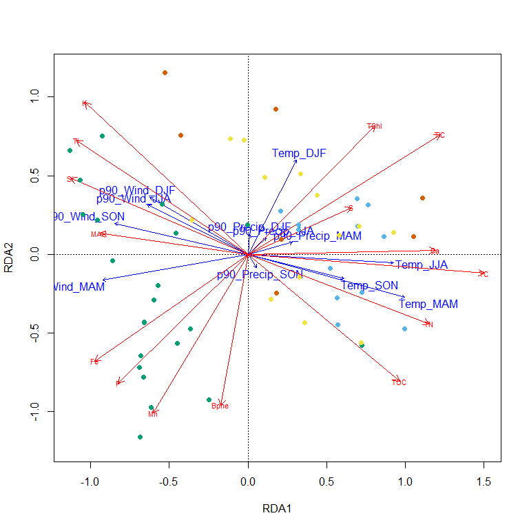<!-- -->

## Generalized Additive Models (GAMs)

### Spring and Summer Temperature (MAMJJA) model

``` r
VT <- as.data.frame(rev(mycl$group))
Annual_data_comb <- cbind(proxy_ann_all, meteo_ann_mean)
Annual_data_comb$VT <- VT[1:54,1]
# MAMJJA Temp GAM
gam_MAMJJA_temp <- gam(Temp_MAMJJA ~ s(TC) + s(Ti), data = Annual_data_comb, method = "REML", select = TRUE)
summary(gam_MAMJJA_temp)
```

    ## 
    ## Family: gaussian 
    ## Link function: identity 
    ## 
    ## Formula:
    ## Temp_MAMJJA ~ s(TC) + s(Ti)
    ## 
    ## Parametric coefficients:
    ##             Estimate Std. Error t value Pr(>|t|)    
    ## (Intercept) 12.08264    0.09249   130.6   <2e-16 ***
    ## ---
    ## Signif. codes:  0 '***' 0.001 '**' 0.01 '*' 0.05 '.' 0.1 ' ' 1
    ## 
    ## Approximate significance of smooth terms:
    ##          edf Ref.df     F  p-value    
    ## s(TC) 0.9616      9 2.781 4.47e-06 ***
    ## s(Ti) 0.9065      9 1.077  0.00184 ** 
    ## ---
    ## Signif. codes:  0 '***' 0.001 '**' 0.01 '*' 0.05 '.' 0.1 ' ' 1
    ## 
    ## R-sq.(adj) =  0.548   Deviance explained = 56.4%
    ## -REML = 59.676  Scale est. = 0.46196   n = 54

``` r
pred_MAMJJA_temp <- as_tibble(as.data.frame(predict(gam_MAMJJA_temp, se.fit = TRUE, unconditional = TRUE)))
pred_MAMJJA_temp <- bind_cols(Annual_data_comb, pred_MAMJJA_temp) %>%
  mutate(upr = fit + 2 * se.fit, lwr = fit - 2 * se.fit)
theme_set(theme_bw())
MAMJJA_temp_plot <- ggplot(Annual_data_comb, aes(x = varve_year, y = Temp_MAMJJA)) +
  geom_point() +
  scale_x_continuous(breaks = seq(1965, 2020, 5), limits = c(1965, 2020)) +
  geom_ribbon(
    data = pred_MAMJJA_temp,
    mapping = aes(ymin = lwr, ymax = upr, x = varve_year), alpha = 0.4, inherit.aes = FALSE,
    fill = "lightblue"
  ) +
  geom_line(
    data = pred_MAMJJA_temp,
    mapping = aes(y = fit, x = varve_year), inherit.aes = FALSE, size = 1, colour = "black"
  ) +
  labs(x = "varve_year", y = "MAMJJA Temp (°C)") +
  theme(panel.grid.major = element_blank(), panel.grid.minor = element_blank())
MAMJJA_temp_plot
```

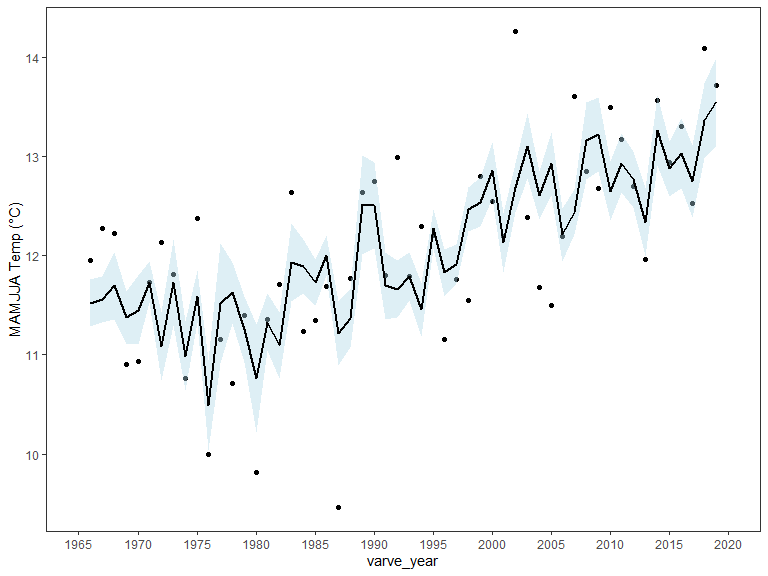<!-- -->

``` r
plot(gam_MAMJJA_temp, pages = 1, all.terms = TRUE, shade = TRUE, residuals = TRUE, pch = 1, cex = 1, seWithMean = TRUE, shade.col = "lightblue")
```

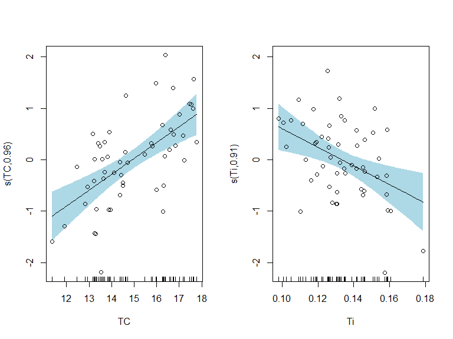<!-- -->

Diagnostic plots

``` r
par(mfrow = c(3, 2))
gam.check(gam_MAMJJA_temp)
```

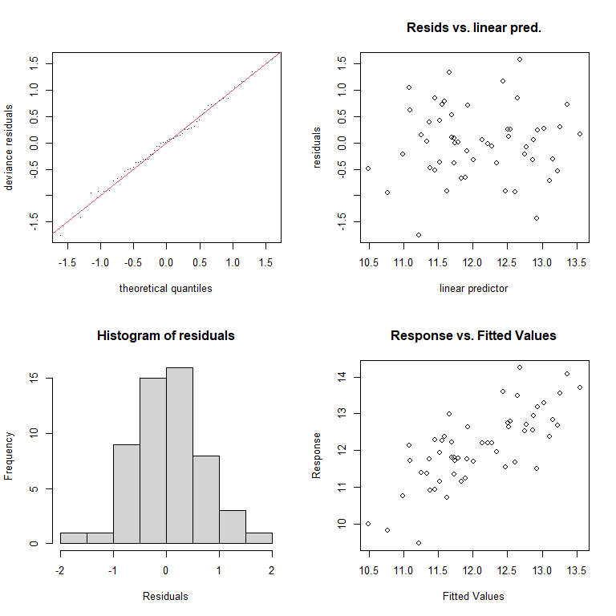<!-- -->

    ## 
    ## Method: REML   Optimizer: outer newton
    ## full convergence after 12 iterations.
    ## Gradient range [-2.820061e-05,1.069222e-05]
    ## (score 59.67644 & scale 0.4619602).
    ## Hessian positive definite, eigenvalue range [1.536549e-06,26.51675].
    ## Model rank =  19 / 19 
    ## 
    ## Basis dimension (k) checking results. Low p-value (k-index<1) may
    ## indicate that k is too low, especially if edf is close to k'.
    ## 
    ##          k'   edf k-index p-value
    ## s(TC) 9.000 0.962    1.14    0.74
    ## s(Ti) 9.000 0.906    0.98    0.40

``` r
acf(gam_MAMJJA_temp$residuals, lag.max = 36, main = "ACF")
pacf(gam_MAMJJA_temp$residuals, lag.max = 36, main = "pACF")
```

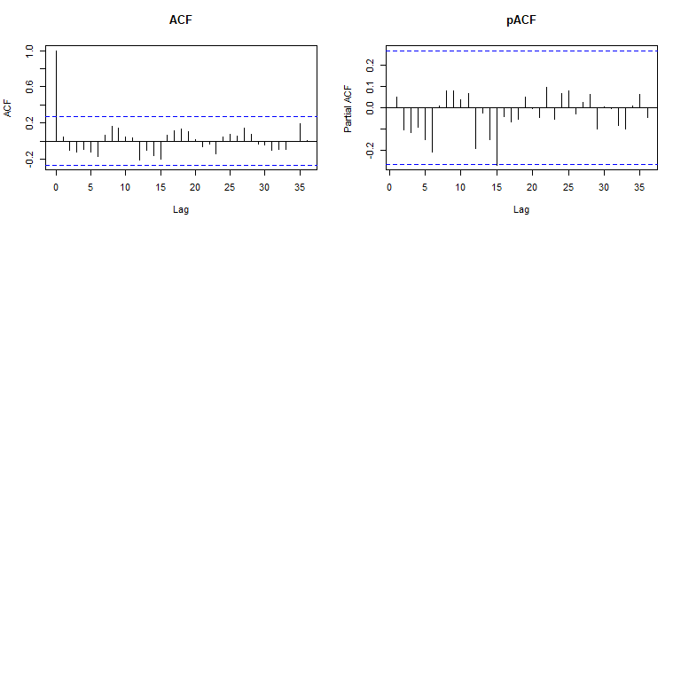<!-- -->

10-fold cross-validated RMSE

``` r
CV_temp <- CVgam(formula = Temp_MAMJJA ~ s(TC) + s(Ti), data = Annual_data_comb, method = "REML")
```

    ##    GAMscale CV-mse-GAM  
    ##      0.4577      0.4797

``` r
paste("CV-RMSE (°C) = ", round(sqrt(CV_temp$cvscale), digits = 2))
```

    ## [1] "CV-RMSE (°C) =  0.69"

``` r
paste("CV-RMSE (%) = ", round(100 * sqrt(CV_temp$cvscale) / (max(Annual_data_comb$Temp_MAMJJA) - min(Annual_data_comb$Temp_MAMJJA)), digits = 2))
```

    ## [1] "CV-RMSE (%) =  14.42"

Split-period calibration and validation (MAMJJA Temperature)

``` r
# preparing summary table
Annual_data_comb_cal <- Annual_data_comb[Annual_data_comb$varve_year <= 1992, ]
Annual_data_comb_ver <- Annual_data_comb[Annual_data_comb$varve_year > 1992, ]

split_period_temp <- data.frame(cal_period = c("1966-1992", "1993-2019"), val_period = c("1993-2019", "1966-1992"), Rsqr_adj = NA, RE = NA, CE = NA, RMSE = NA)
# calibration model
gam_MAMJJA_temp_cal <- gam(Temp_MAMJJA ~ s(TC) + s(Ti), data = Annual_data_comb_cal, method = "REML", select = TRUE)
split_period_temp$Rsqr_adj[1] <- summary(gam_MAMJJA_temp_cal)$r.sq

# Calculate RE, CE, RMSE
pred_MAMJJA_temp_cal <- as_tibble(as.data.frame(predict(gam_MAMJJA_temp_cal, newdata = Annual_data_comb, se.fit = TRUE, unconditional = TRUE)))
pred_MAMJJA_temp_ver <- as_tibble(as.data.frame(predict(gam_MAMJJA_temp_cal, newdata = Annual_data_comb_ver, se.fit = TRUE, unconditional = TRUE)))

RE_MAMJJA_temp <- 1 - sum((Annual_data_comb_ver$Temp_MAMJJA - pred_MAMJJA_temp_ver$fit)^2) / sum((Annual_data_comb_ver$Temp_MAMJJA - mean(Annual_data_comb_cal$Temp_MAMJJA))^2)
split_period_temp$RE[1] <- RE_MAMJJA_temp

CE_MAMJJA_temp <- 1 - sum((Annual_data_comb_ver$Temp_MAMJJA - pred_MAMJJA_temp_ver$fit)^2) / sum((Annual_data_comb_ver$Temp_MAMJJA - mean(Annual_data_comb_ver$Temp_MAMJJA))^2)
split_period_temp$CE[1] <- CE_MAMJJA_temp

RMSEP_MAMJJA_temp <- sqrt(mean((Annual_data_comb_ver$Temp_MAMJJA - pred_MAMJJA_temp_ver$fit)^2))
split_period_temp$RMSE[1] <- paste(round(RMSEP_MAMJJA_temp, digits = 3), " (", round(100 * RMSEP_MAMJJA_temp / (max(Annual_data_comb$Temp_MAMJJA) - min(Annual_data_comb$Temp_MAMJJA)), digits = 3), "%)")

# now switching calibration and verification periods
gam_MAMJJA_temp_ver <- gam(Temp_MAMJJA ~ s(TC) + s(Ti), data = Annual_data_comb_ver, method = "REML", select = TRUE)
split_period_temp$Rsqr_adj[2] <- summary(gam_MAMJJA_temp_ver)$r.sq
pred_MAMJJA_temp_ver_2 <- as_tibble(as.data.frame(predict(gam_MAMJJA_temp_ver, newdata = Annual_data_comb_cal, se.fit = TRUE, unconditional = TRUE)))
RE_MAMJJA_temp_2 <- 1 - sum((Annual_data_comb_cal$Temp_MAMJJA - pred_MAMJJA_temp_ver_2$fit)^2) / sum((Annual_data_comb_cal$Temp_MAMJJA - mean(Annual_data_comb_ver$Temp_MAMJJA))^2)
split_period_temp$RE[2] <- RE_MAMJJA_temp_2

CE_MAMJJA_temp_2 <- 1 - sum((Annual_data_comb_cal$Temp_MAMJJA - pred_MAMJJA_temp_ver_2$fit)^2) / sum((Annual_data_comb_cal$Temp_MAMJJA - mean(Annual_data_comb_cal$Temp_MAMJJA))^2)
split_period_temp$CE[2] <- CE_MAMJJA_temp_2

RMSEP_MAMJJA_temp_2 <- sqrt(mean((Annual_data_comb_cal$Temp_MAMJJA - pred_MAMJJA_temp_ver_2$fit)^2))
split_period_temp$RMSE[2] <- paste(round(RMSEP_MAMJJA_temp_2, digits = 3), " (", round(100 * RMSEP_MAMJJA_temp_2 / (max(Annual_data_comb$Temp_MAMJJA) - min(Annual_data_comb$Temp_MAMJJA)), digits = 3), "%)")

split_period_temp
```

    ##   cal_period val_period  Rsqr_adj        RE        CE               RMSE
    ## 1  1966-1992  1993-2019 0.3925724 0.7499937 0.2982079 0.677  ( 14.097 %)
    ## 2  1993-2019  1966-1992 0.3467264 0.6682707 0.1543255 0.803  ( 16.713 %)

``` r
# split period plot
pred_MAMJJA_temp_ver_3 <- as_tibble(as.data.frame(predict(gam_MAMJJA_temp_ver, newdata = Annual_data_comb, se.fit = TRUE, unconditional = TRUE)))
pred_MAMJJA_temp_ver_3 <- bind_cols(Annual_data_comb, pred_MAMJJA_temp_ver_3)
pred_MAMJJA_temp_cal_3 <- as_tibble(as.data.frame(predict(gam_MAMJJA_temp_cal, newdata = Annual_data_comb, se.fit = TRUE, unconditional = TRUE)))
pred_MAMJJA_temp_cal_3 <- bind_cols(Annual_data_comb, pred_MAMJJA_temp_cal_3)
theme_set(theme_bw())
gam_MAMJJA_temp_split <- ggplot(Annual_data_comb, aes(x = varve_year, y = Temp_MAMJJA)) +
  geom_point() +
  scale_x_continuous(breaks = seq(1965, 2020, 5), limits = c(1965, 2020)) +
  geom_line(
    data = pred_MAMJJA_temp,
    mapping = aes(y = fit, x = varve_year), inherit.aes = FALSE, size = 1, colour = "black"
  ) +
    geom_line(
    data = pred_MAMJJA_temp_ver_3,
    mapping = aes(y = fit, x = varve_year), inherit.aes = FALSE, size = 1, colour = "red"
  ) +
    geom_line(
    data = pred_MAMJJA_temp_cal_3,
    mapping = aes(y = fit, x = varve_year), inherit.aes = FALSE, size = 1, colour = "blue"
  ) +
  labs(x = "Year", y = "MAMJJA Temp (°C)") +
  theme(panel.grid.major = element_blank(), panel.grid.minor = element_blank())
gam_MAMJJA_temp_split
```

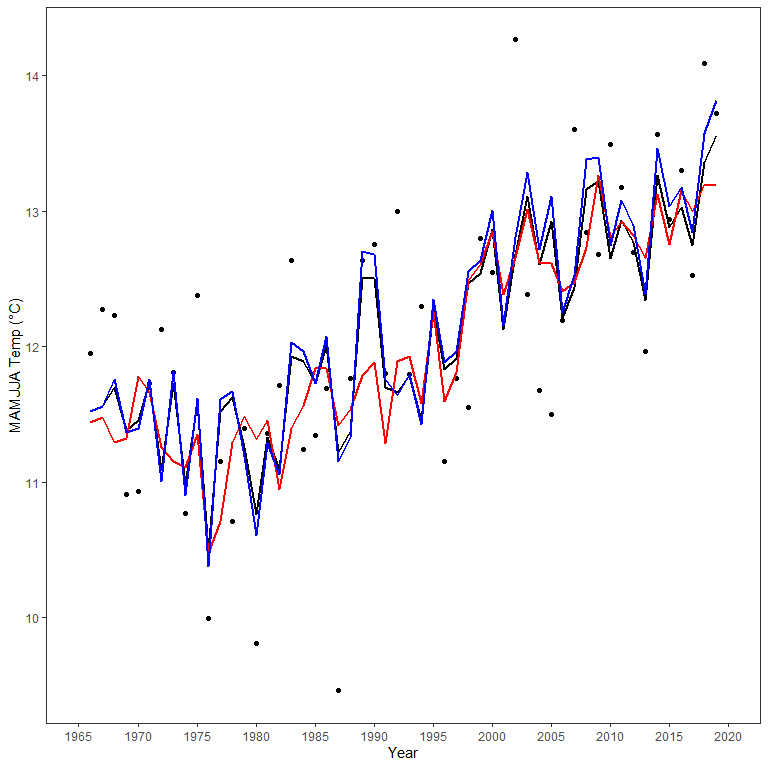<!-- -->

### March-December wind days (\> 7 m/s) model

``` r
# removing missing years
wind_data_comb <- Annual_data_comb[Annual_data_comb$varve_year != 1994 & Annual_data_comb$varve_year != 1993, ]

gam_wind_days_MAR_DEC <- gam(MAR_DEC_Wind_Days ~ s(MAR) + s(Si), data = wind_data_comb, method = "REML", select = TRUE)

summary(gam_wind_days_MAR_DEC)
```

    ## 
    ## Family: gaussian 
    ## Link function: identity 
    ## 
    ## Formula:
    ## MAR_DEC_Wind_Days ~ s(MAR) + s(Si)
    ## 
    ## Parametric coefficients:
    ##             Estimate Std. Error t value Pr(>|t|)    
    ## (Intercept)  13.3462     0.8181   16.31   <2e-16 ***
    ## ---
    ## Signif. codes:  0 '***' 0.001 '**' 0.01 '*' 0.05 '.' 0.1 ' ' 1
    ## 
    ## Approximate significance of smooth terms:
    ##           edf Ref.df     F  p-value    
    ## s(MAR) 0.9192      9 1.260 0.000817 ***
    ## s(Si)  0.9065      9 1.074 0.001750 ** 
    ## ---
    ## Signif. codes:  0 '***' 0.001 '**' 0.01 '*' 0.05 '.' 0.1 ' ' 1
    ## 
    ## R-sq.(adj) =  0.478   Deviance explained = 49.6%
    ## -REML = 167.48  Scale est. = 34.804    n = 52

``` r
pred_wind_days_MAR_DEC <- as_tibble(as.data.frame(predict(gam_wind_days_MAR_DEC, se.fit = TRUE, unconditional = TRUE)))
pred_wind_days_MAR_DEC <- bind_cols(wind_data_comb, pred_wind_days_MAR_DEC) %>%
  mutate(upr = fit + 2 * se.fit, lwr = fit - 2 * se.fit)
theme_set(theme_bw())
wind_days_MAR_DEC_plot <- ggplot(wind_data_comb, aes(x = varve_year, y = MAR_DEC_Wind_Days)) +
  geom_point() +
  scale_x_continuous(breaks = seq(1965, 2020, 5), limits = c(1965, 2020)) +
  geom_ribbon(
    data = pred_wind_days_MAR_DEC,
    mapping = aes(ymin = lwr, ymax = upr, x = varve_year), alpha = 0.4, inherit.aes = FALSE,
    fill = "lightblue"
  ) +
  geom_line(
    data = pred_wind_days_MAR_DEC,
    mapping = aes(y = fit, x = varve_year), inherit.aes = FALSE, size = 1, colour = "black"
  ) +
  labs(x = "Year", y = "# of days with mean wind speed > 7 m/s")
wind_days_MAR_DEC_plot
```

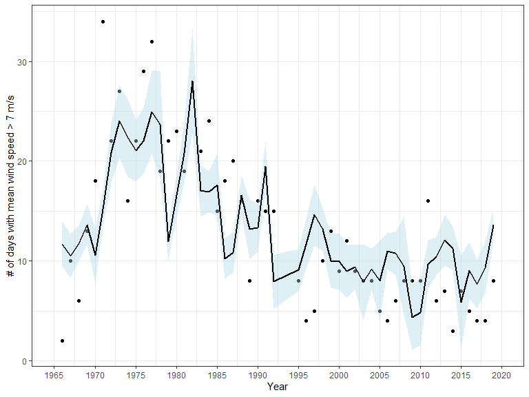<!-- -->

``` r
plot(gam_wind_days_MAR_DEC, pages = 1, shade = TRUE, residuals = TRUE, pch = 1, cex = 1, seWithMean = TRUE, shade.col = "lightblue")
```

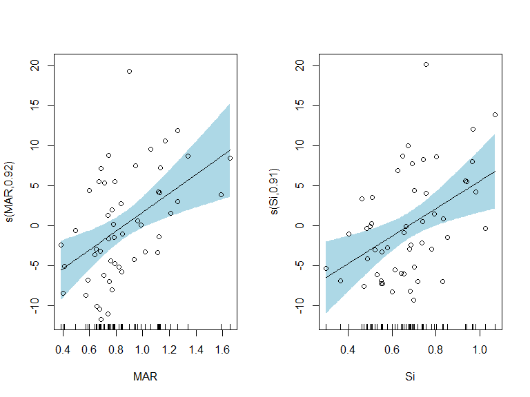<!-- -->

Diagnostic plots

``` r
par(mfrow = c(3, 2))
gam.check(gam_wind_days_MAR_DEC)
```

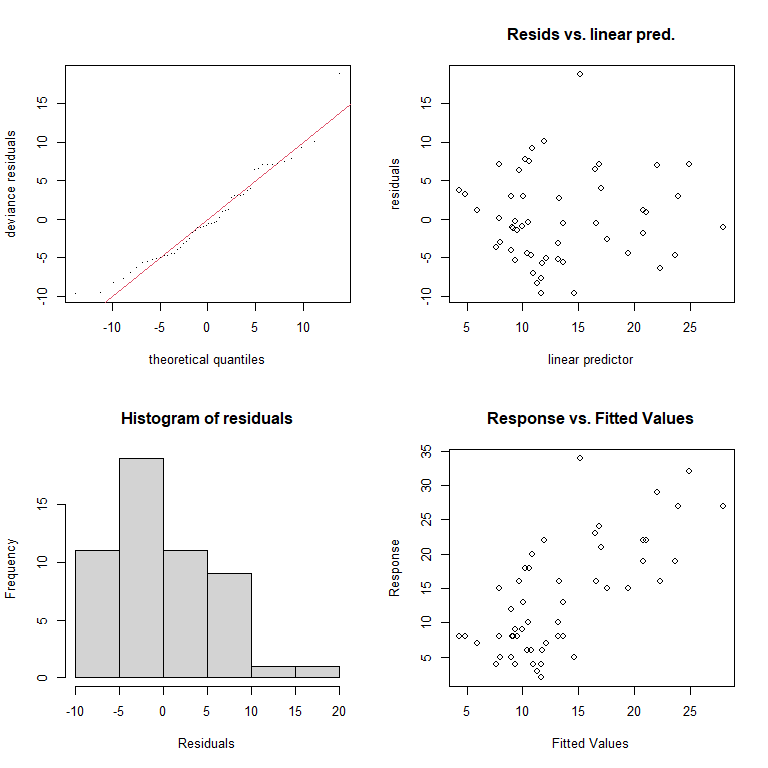<!-- -->

    ## 
    ## Method: REML   Optimizer: outer newton
    ## full convergence after 13 iterations.
    ## Gradient range [-6.492196e-05,0.0001896789]
    ## (score 167.4796 & scale 34.80371).
    ## Hessian positive definite, eigenvalue range [2.334065e-05,25.51643].
    ## Model rank =  19 / 19 
    ## 
    ## Basis dimension (k) checking results. Low p-value (k-index<1) may
    ## indicate that k is too low, especially if edf is close to k'.
    ## 
    ##           k'   edf k-index p-value
    ## s(MAR) 9.000 0.919    1.34    0.99
    ## s(Si)  9.000 0.906    0.99    0.43

``` r
acf(gam_wind_days_MAR_DEC$residuals, lag.max = 36, main = "ACF")
pacf(gam_wind_days_MAR_DEC$residuals, lag.max = 36, main = "pACF")
```

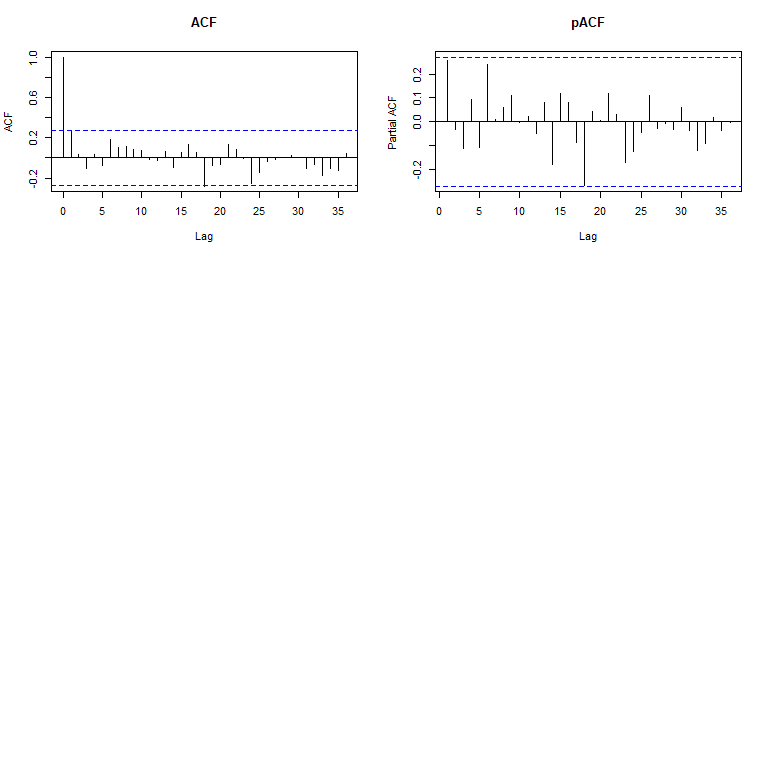<!-- -->

10-fold cross-validated RMSE

``` r
CV_wind <- CVgam(formula = MAR_DEC_Wind_Days ~ s(MAR) + s(Si), data = wind_data_comb, method = "REML")
```

    ##    GAMscale CV-mse-GAM  
    ##     34.8747     36.8989

``` r
paste("CV-RMSE (days) = ", round(sqrt(CV_wind$cvscale), digits = 2))
```

    ## [1] "CV-RMSE (days) =  6.07"

``` r
paste("CV-RMSE (%) = ", round(100 * sqrt(CV_wind$cvscale) / (max(wind_data_comb$MAR_DEC_Wind_Days) - min(wind_data_comb$MAR_DEC_Wind_Days)), digits = 2))
```

    ## [1] "CV-RMSE (%) =  18.98"

Split-period calibration and validation

``` r
wind_data_comb_cal <- wind_data_comb[wind_data_comb$varve_year <= 1991, ]
wind_data_comb_ver <- wind_data_comb[wind_data_comb$varve_year > 1991, ]

# preparing summary table
split_period_wind <- data.frame(cal_period = c("1966-1991", "1992, 1995-2019"), val_period = c("1992, 1995-2019", "1966-1991"), Rsqr_adj = NA, RE = NA, CE = NA, RMSE = NA)
# calibration model
gam_wind_days_MAR_DEC_cal <- gam(MAR_DEC_Wind_Days ~ s(MAR) + s(Si), data = wind_data_comb_cal, method = "REML", select = TRUE)
split_period_wind$Rsqr_adj[1] <- summary(gam_wind_days_MAR_DEC_cal)$r.sq

# Calculate RE, CE, RMSE
pred_wind_days_ver <- as_tibble(as.data.frame(predict(gam_wind_days_MAR_DEC_cal, newdata = wind_data_comb_ver, se.fit = TRUE, unconditional = TRUE)))
RE_wind_days <- 1 - sum((wind_data_comb_ver$MAR_DEC_Wind_Days - pred_wind_days_ver$fit)^2) / sum((wind_data_comb_ver$MAR_DEC_Wind_Days - mean(wind_data_comb_cal$MAR_DEC_Wind_Days))^2)
split_period_wind$RE[1] <- RE_wind_days

CE_wind_days <- 1 - sum((wind_data_comb_ver$MAR_DEC_Wind_Days - pred_wind_days_ver$fit)^2) / sum((wind_data_comb_ver$MAR_DEC_Wind_Days - mean(wind_data_comb_ver$MAR_DEC_Wind_Days))^2)
split_period_wind$CE[1] <- CE_wind_days

RMSEP_wind_days <- sqrt(mean((wind_data_comb_ver$MAR_DEC_Wind_Days - pred_wind_days_ver$fit)^2))
split_period_wind$RMSE[1] <- paste(round(RMSEP_wind_days, digits = 3), " (", round(100 * RMSEP_wind_days / (max(wind_data_comb$MAR_DEC_Wind_Days) - min(wind_data_comb$MAR_DEC_Wind_Days)), digits = 3), "%)")

# now using ver as cal
gam_wind_days_MAR_DEC_ver <- gam(MAR_DEC_Wind_Days ~ s(MAR) + s(Si), data = wind_data_comb_ver, method = "REML", select = TRUE)
split_period_wind$Rsqr_adj[2] <- summary(gam_wind_days_MAR_DEC_ver)$r.sq

pred_wind_days_ver_2 <- as_tibble(as.data.frame(predict(gam_wind_days_MAR_DEC_ver, newdata = wind_data_comb_cal, se.fit = TRUE, unconditional = TRUE)))
RE_wind_days_2 <- 1 - sum((wind_data_comb_cal$MAR_DEC_Wind_Days - pred_wind_days_ver_2$fit)^2) / sum((wind_data_comb_cal$MAR_DEC_Wind_Days - mean(wind_data_comb_ver$MAR_DEC_Wind_Days))^2)
split_period_wind$RE[2] <- RE_wind_days_2

CE_wind_days_2 <- 1 - sum((wind_data_comb_cal$MAR_DEC_Wind_Days - pred_wind_days_ver_2$fit)^2) / sum((wind_data_comb_cal$MAR_DEC_Wind_Days - mean(wind_data_comb_cal$MAR_DEC_Wind_Days))^2)
split_period_wind$CE[2] <- CE_wind_days_2

RMSEP_wind_days_2 <- sqrt(mean((wind_data_comb_cal$MAR_DEC_Wind_Days - pred_wind_days_ver_2$fit)^2))
split_period_wind$RMSE[2] <- paste(round(RMSEP_wind_days_2, digits = 3), " (", round(100 * RMSEP_wind_days_2 / (max(wind_data_comb$MAR_DEC_Wind_Days) - min(wind_data_comb$MAR_DEC_Wind_Days)), digits = 3), "%)")

split_period_wind
```

    ##        cal_period      val_period  Rsqr_adj         RE        CE
    ## 1       1966-1991 1992, 1995-2019 0.2999138  0.6114674 -3.944040
    ## 2 1992, 1995-2019       1966-1991 0.1497534 -0.2830619 -3.220727
    ##                  RMSE
    ## 1  7.343  ( 22.946 %)
    ## 2 15.353  ( 47.978 %)

``` r
# split period plot
pred_wind_days_ver_3 <- as_tibble(as.data.frame(predict(gam_wind_days_MAR_DEC_ver, newdata = wind_data_comb, se.fit = TRUE, unconditional = TRUE)))
pred_wind_days_ver_3 <- bind_cols(wind_data_comb, pred_wind_days_ver_3)
pred_wind_days_cal_3 <- as_tibble(as.data.frame(predict(gam_wind_days_MAR_DEC_cal, newdata = wind_data_comb, se.fit = TRUE, unconditional = TRUE)))
pred_wind_days_cal_3 <- bind_cols(wind_data_comb, pred_wind_days_cal_3)
theme_set(theme_bw())
gam_wind_days_MAR_DEC_split <- ggplot(wind_data_comb, aes(x = varve_year, y = MAR_DEC_Wind_Days)) +
  geom_point() +
  scale_x_continuous(breaks = seq(1965, 2020, 5), limits = c(1965, 2020)) +
  geom_line(
    data = pred_wind_days_MAR_DEC,
    mapping = aes(y = fit, x = varve_year), inherit.aes = FALSE, size = 1, colour = "black"
  ) +
    geom_line(
    data = pred_wind_days_ver_3,
    mapping = aes(y = fit, x = varve_year), inherit.aes = FALSE, size = 1, colour = "red"
  ) +
    geom_line(
    data = pred_wind_days_cal_3,
    mapping = aes(y = fit, x = varve_year), inherit.aes = FALSE, size = 1, colour = "blue"
  ) +
  labs(x = "Year", y = "# of days with mean wind speed > 7 m/s") +
  theme(panel.grid.major = element_blank(), panel.grid.minor = element_blank())
gam_wind_days_MAR_DEC_split
```

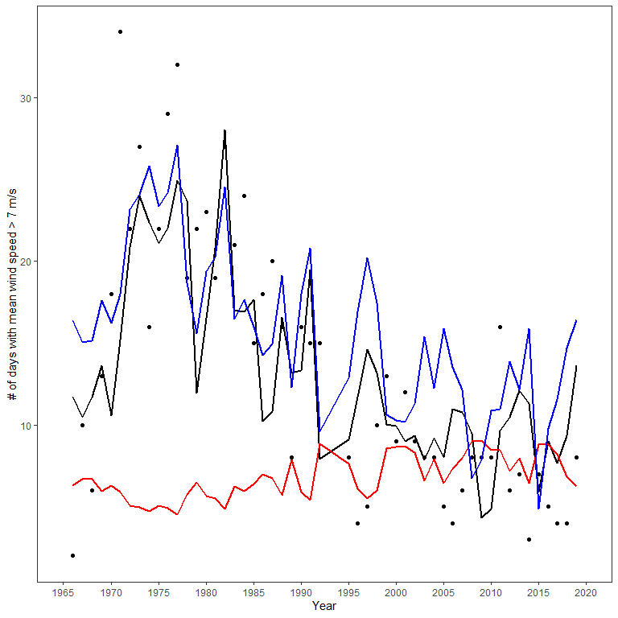<!-- -->

## Supplementary correlation plots

``` r
"Annual resolution proxy data"
```

    ## [1] "Annual resolution proxy data"

``` r
corrplot(cor(proxy_ann_all), addCoef.col = "black", number.cex = 10 / ncol(proxy_ann_all))
```

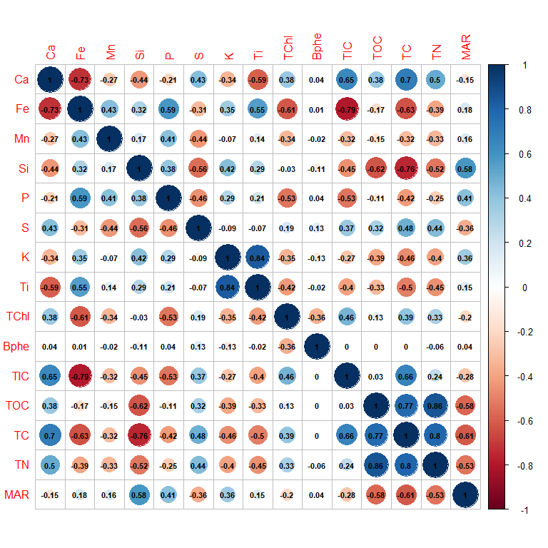<!-- -->

``` r
"Full resolution (60 um) scanning proxy data"
```

    ## [1] "Full resolution (60 um) scanning proxy data"

``` r
corrplot(cor(HiRes_full[HiRes_full$varve_year >= 1966, 4:14]), addCoef.col = "black", number.cex = 10 / ncol(HiRes_full[, 4:14]))
```

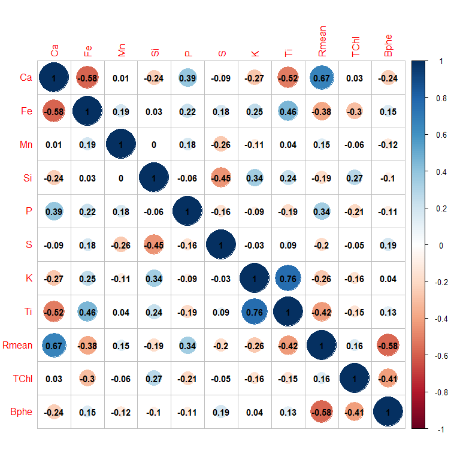<!-- -->

``` r
"Seasonal meteo data"
```

    ## [1] "Seasonal meteo data"

``` r
corrplot(cor(meteo_sub1), addCoef.col = "black", number.cex = 10 / ncol(meteo_sub1))
```

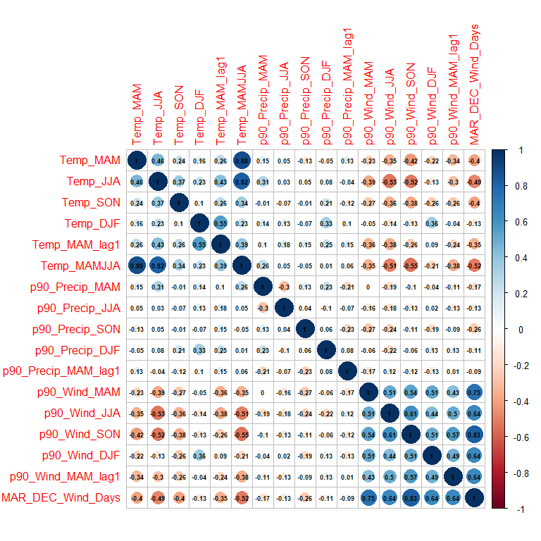<!-- -->

# Session info

``` r
Sys.Date()
```

    ## [1] "2023-12-20"

``` r
sessionInfo()
```

    ## R version 4.3.1 (2023-06-16 ucrt)
    ## Platform: x86_64-w64-mingw32/x64 (64-bit)
    ## Running under: Windows 10 x64 (build 19044)
    ## 
    ## Matrix products: default
    ## 
    ## 
    ## locale:
    ## [1] LC_COLLATE=English_Germany.utf8  LC_CTYPE=English_Germany.utf8   
    ## [3] LC_MONETARY=English_Germany.utf8 LC_NUMERIC=C                    
    ## [5] LC_TIME=English_Germany.utf8    
    ## 
    ## time zone: Europe/Berlin
    ## tzcode source: internal
    ## 
    ## attached base packages:
    ## [1] grid      stats     graphics  grDevices utils     datasets  methods  
    ## [8] base     
    ## 
    ## other attached packages:
    ##  [1] mvnormtest_0.1-9  cowplot_1.1.1     gamclass_0.62.5   gridExtra_2.3    
    ##  [5] mgcv_1.8-42       nlme_3.1-160      reshape2_1.4.4    pracma_2.4.2     
    ##  [9] viridis_0.6.3     viridisLite_0.4.2 distantia_1.0.2   psych_2.2.9      
    ## [13] corrplot_0.92     vegan_2.6-4       lattice_0.21-8    permute_0.9-7    
    ## [17] lineup_0.42       forcats_0.5.2     stringr_1.5.0     dplyr_1.1.2      
    ## [21] purrr_1.0.1       readr_2.1.4       tidyr_1.3.0       tibble_3.2.1     
    ## [25] tidyverse_1.3.2   ggplot2_3.4.2     dtw_1.23-1        proxy_0.4-27     
    ## [29] data.table_1.14.8 pacman_0.5.1     
    ## 
    ## loaded via a namespace (and not attached):
    ##  [1] DBI_1.1.3            mnormt_2.1.1         deldir_1.0-9        
    ##  [4] readxl_1.4.1         rlang_1.1.1          magrittr_2.0.3      
    ##  [7] compiler_4.3.1       png_0.1-8            vctrs_0.6.2         
    ## [10] maps_3.4.1           rvest_1.0.3          pkgconfig_2.0.3     
    ## [13] crayon_1.5.2         fastmap_1.1.1        ellipsis_0.3.2      
    ## [16] backports_1.4.1      dbplyr_2.2.1         labeling_0.4.2      
    ## [19] utf8_1.2.3           rmarkdown_2.21       tzdb_0.4.0          
    ## [22] haven_2.5.1          xfun_0.39            reprex_2.0.2        
    ## [25] randomForest_4.7-1.1 jsonlite_1.8.4       highr_0.10          
    ## [28] gmp_0.7-3            jpeg_0.1-10          broom_1.0.1         
    ## [31] parallel_4.3.1       cluster_2.1.4        R6_2.5.1            
    ## [34] stringi_1.7.12       RColorBrewer_1.1-3   rpart_4.1.19        
    ## [37] lubridate_1.9.2      cellranger_1.1.0     Rcpp_1.0.10         
    ## [40] assertthat_0.2.1     iterators_1.0.14     knitr_1.43          
    ## [43] modelr_0.1.9         fields_14.1          Matrix_1.5-1        
    ## [46] splines_4.3.1        timechange_0.2.0     tidyselect_1.2.0    
    ## [49] rstudioapi_0.14      yaml_2.3.7           doParallel_1.0.17   
    ## [52] codetools_0.2-19     arrangements_1.1.9   plyr_1.8.8          
    ## [55] withr_2.5.0          evaluate_0.21        xml2_1.3.3          
    ## [58] pillar_1.9.0         foreach_1.5.2        generics_0.1.3      
    ## [61] hms_1.1.3            munsell_0.5.0        scales_1.2.1        
    ## [64] glue_1.6.2           tools_4.3.1          interp_1.1-3        
    ## [67] fs_1.6.2             dotCall64_1.0-2      latticeExtra_0.6-30 
    ## [70] colorspace_2.1-0     googlesheets4_1.0.1  googledrive_2.0.0   
    ## [73] cli_3.6.1            spam_2.9-1           fansi_1.0.4         
    ## [76] gargle_1.2.1         gtable_0.3.3         digest_0.6.31       
    ## [79] farver_2.1.1         htmltools_0.5.5      lifecycle_1.0.3     
    ## [82] httr_1.4.6           MASS_7.3-58.1
